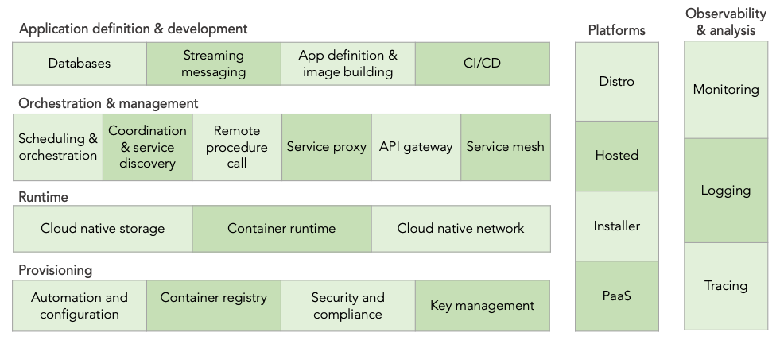

# CNCF简介（零）云原生计算基金会

[云原生图景](https://landscape.cncf.io/)

## CNCF是什么

从孵化成熟阶段开始，要想最终毕业，项目必须表现出高度的多样性，被大量用户广泛使用，拥有正式的治理过程，并且面向整个开源社区坚持其可持续性及包容性。

### 何谓之CNCF“毕业项目”？

CNCF 项目毕业标准中关于毕业条件是这样定义的：

* 有来自至少两个机构的提交者。
* 已经实现并维护了核心基础结构计划（CII）的最佳实践徽章。
* 采用 CNCF 行为准则。
* 明确定义项目治理和提交者流程。这最好在 GOVERNANCE.md 文件中进行，并引用 OWNERS.md 文件显示当前和荣誉提交者。
* 至少在主要仓库提供项目采用者的公开列表（例如，ADOPTERS.md 文件或项目网站上的徽标）。
* 获得 TOC 的绝对多数选票进入毕业阶段。如果项目能够表现出足够的成熟度，项目可以尝试直接从沙箱移动到毕业。项目可以无限期地保持在孵化状态，但通常预计在两年内毕业。

## CNCF层次架构

从文章开头的云原生图景可以看到：云原生所使用的相关软件按照功能划分为了很多不同的模块，每个模块都解决了一个特定的问题：

### [供应层（Provisioning）](供应层.md)
-|功能|相关软件举例
-|-|-
自动化和配置工具（Automation & Configuration）|自动帮你在机器上装环境|KubeEdge：以容器的形式管理边缘设备 OpenStack、Ansible、VMWare vSphere等
容器仓库（Container Registry）|存储你的容器镜像|Harbor：企业级私有Registry 服务器 Dragonfly：支持镜像分发的P2P文件分发系统
安全与合规（Security & Compliance）|确保系统运行的是正确的容器|TUF：专注于保护软件的更新过程 Notary：确保下载了正确的镜像 Falco：侦测异常操作 Open Policy Agent：云原生时代的策略引擎，控制几乎所有活动的权限
密钥管理（Key management）|安全地存储、分发、销毁机密信息|Spiffe/Spire：内部微服务间通信的消息加密验证

### [运行时层（Runtime）](运行时层.md)
-|功能|相关软件举例
-|-|-
云原生存储（Cloud native storage）|存放必须长久保存的持久数据|ROOK：在各种分布式存储系统上套一层统一的API
容器运行时（Container runtime）|约束容器的活动范围|containerd：Docker引擎的底层运行时管理器 CRI-O：想成为Kubernetes默认容器驱动的Docker替代品
云网络（Cloud native networking）|容器间的网络连接|CNI(Container Network Interface)容器网络接口标准

### [编排和管理层（Orchestration & Management）](编排和管理层.md)
-|功能|相关软件举例
-|-|-
编排和调度（Orchestration & scheduling）|在集群中自动地运行和管理容器|Kubernetes、MESOS、Docker Swarm
协调和服务发现（Coordination and service discovery）|让快速生生灭灭的大批容器互相能找到对方|CoreDNS：用DNS找到对方 etcd：在数据库中找到对方
远程过程调用（RPC）|应用间的相互远程调用|Google家的gRPC、腾讯的TARS、阿里的Dubbo
服务代理（Service proxy）|在应用不知道的情况下把它的请求转发到正确的地方并监控之|Envoy：一个牛逼的L3/L4/L7代理服务器 Contour：基于Envoy的K8S Ingress Controller Nginx、Haproxy、traefik等
API网关（API gateway）|在代理转发之前对请求进行验证鉴权转换等处理|基于Envoy的API网关：Ambassador、Gloo等
服务网格（Service mesh）|在应用不知道的情况下进行配置、路由、遥测、记录、断路等网络功能|服务网格接口规范：SMI(Service Mesh Interface) Linkerd：自带代理程序的Service mesh控制面板 Istio：基于Envoy代理的Service mesh控制面板

* [应用程序定义和开发层（Application Definition & Development）](应用程序定义和开发层.md)
  * 数据库（Databases）
  * 流和消息传递（Streaming & messaging）
  * 应用程序定义和镜像构建（Application definition &image build）
  * 持续集成和持续交付（CI/CD）
* [可观察性与分析（Observability &Analysis）](可观察性与分析.md)
  * 日志记录（Logging）
  * 监视（Monitoring）
  * 跟踪（Tracing）
  * 混沌工程（Chaos engineering）
* [平台类（Platforms）](平台类.md)
  * Kubernetes发行版
  * Kubernetes托管
  * Kubernetes安装程序
  * PaaS/容器服务
