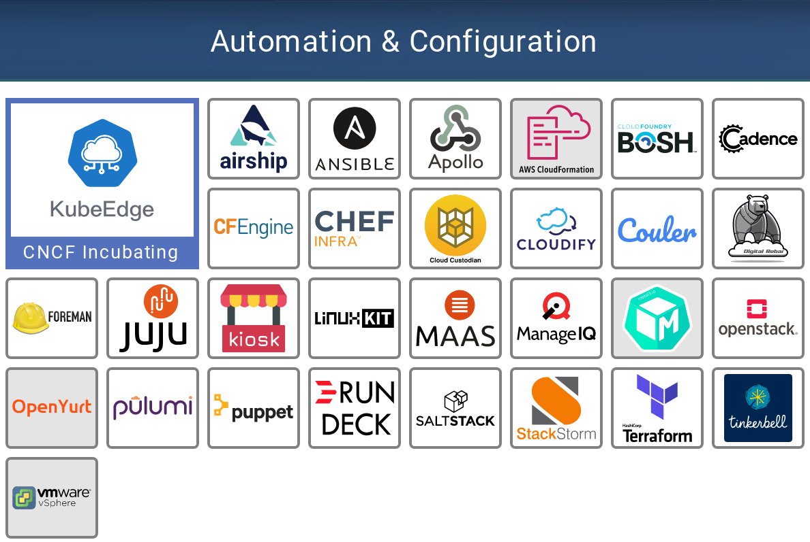
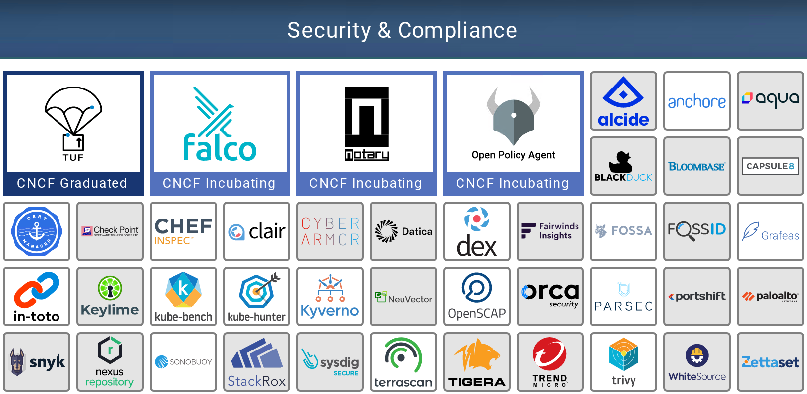
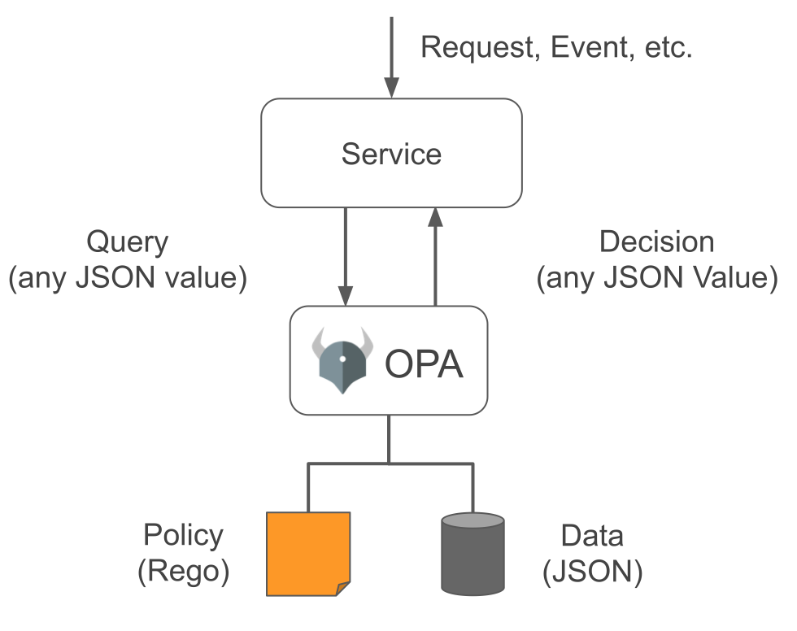

# CNCF Landscape（一）供应层（Provisioning）

前置知识：[《CNCF简介（零）》](CNCF.md)

## 自动化和配置工具（Automation &configuration）

自动化和配置工具可**加快计算资源（虚拟机，网络，防火墙规则，负载均衡器等）的创建和配置**。这些工具可能会处理供应层(Provisioning)的不同部分，或者尝试控制所有端到端的内容。大多数工具，提供与该空间中其他项目和产品集成的能力。

### 解决的问题

**传统上，IT流程依赖冗长且复杂的手动发布周期**，甚至需要三到六个月。这些周期伴随着许多人工流程和控制，从而减缓了生产环境的变更。这些缓慢的发布周期和静态环境与云原生开发不兼容。为了实现快速的开发周期，必须**动态配置基础架构**，并且**无需人工干预**。

### 解决问题的方法

此类工具**使工程师无需人工干预即可构建计算环境**。环境设置，只需单击一个按钮，它就可以实现。手动设置很容易出错，但是一旦进行了编码，环境创建就会与所需的确切状态相匹配，这是巨大的优势。

### 具体软件

* Terraform之类的自动化工具减少了扩展数十个**服务器**和相关**网络**以及多达数百个**防火墙规则**所需的工作量。诸如Chef和Ansible之类的工具会在启动时以编程方式配置这些新服务器和应用程序，并允许开发人员使用它们。
* 像Chef和Terraform一样，许多工具可以进行交互操作以配置环境。诸如OpenStack之类的其他工具，运用**基础架构即服务（IaaS）** 的理念来配置环境。从根本上讲，在此空间中，你需要一个或多个工具来为Kubernetes集群搭建计算环境，CPU，内存，存储和网络。你还需要其中一部分来创建和管理Kubernetes集群本身。

#### CNCF孵化项目：KubeEdge

KubeEdge 的目标是创建一个开放平台，使能边缘计算，将容器化应用编排功能扩展到边缘的**节点**和**设备**，后者基于kubernetes构建，并为云和边缘之间的网络，应用部署和元数据同步提供基础架构支持。

## 镜像仓库（Container Registry）

镜像仓库是用于分类和存储镜像的专用Web应用程序。

镜像仓库工具存储和分发镜像，从根本上说，它是一种Web API，允许容器引擎存储和检索镜像。他们有的还提供接口以允许容器扫描或签名工具来增强存储的镜像的安全性。

### 解决的问题

云原生应用程序打包并作为容器运行。镜像仓库存储并提供这些容器镜像。

### 解决问题的方法

通过将所有容器镜像集中存储在一个地方，任何使用该应用程序的开发人员都可以轻松访问它们。

### 具体软件

每个主要的云提供商都提供自己托管的镜像仓库，图中所展示的阿里的容器服务、亚马逊的ECR、微软的Azure Registry、Google的GCR、IBM的IBM CCR就是这类

许多镜像仓库可以独立部署，比如图中的Harbor和Dragonfly等，也可以通过Helm之类的工具直接部署到Kubernetes集群中。

#### CNCF毕业项目：Harbor

Harbor 是由 VMware 公司中国团队为企业用户设计的 Registry server 开源项目，作为一个企业级私有 Registry 服务器，Harbor 提供了更好的性能和安全。提升用户使用 Registry 构建和运行环境传输镜像的效率。Harbor 支持安装在多个 Registry 节点的镜像资源复制，镜像全部保存在私有 Registry 中， 确保数据和知识产权在公司内部网络中管控。另外，Harbor 也提供了高级的安全特性，诸如用户管理，访问控制和活动审计等。

* 基于角色的访问控制 - 用户与 Docker 镜像仓库通过“项目”进行组织管理，一个用户可以对多个镜像仓库在同一命名空间（project）里有不同的权限。
* 镜像复制 - 镜像可以在多个 Registry 实例中复制（同步）。尤其适合于负载均衡，高可用，混合云和多云的场景。
* 图形化用户界面 - 用户可以通过浏览器来浏览，检索当前 Docker 镜像仓库，管理项目和命名空间。
* AD/LDAP 支持 - Harbor 可以集成企业内部已有的 AD/LDAP，用于鉴权认证管理。
* 审计管理 - 所有针对镜像仓库的操作都可以被记录追溯，用于审计管理。
* 国际化 - 已拥有英文、中文、德文、日文和俄文的本地化版本。更多的语言将会添加进来。
* RESTful API - RESTful API 提供给管理员对于 Harbor 更多的操控, 使得与其它管理软件集成变得更容易。
* 部署简单 - 提供在线和离线两种安装工具， 也可以安装到 vSphere 平台(OVA 方式)虚拟设备。

#### CNCF孵化项目：Dragonfly

Dragonfly（蜻蜓）是阿里自研并捐献给 CNCF 的 P2P 文件分发系统，用于解决大规模文件分发场景下分发耗时、成功率低、带宽浪费等难题。大幅提升发布部署、数据预热、大规模容器镜像分发等业务能力。

Dragonfly 可用于 P2P 文件分发、容器镜像分发、局部限速、磁盘容量预检等。它支持多种容器技术，对容器本身无需做任何改造，镜像分发比 natvie 方式提速可高达 57 倍，Registry 网络出流量降低99.5%以上。

>Dragonfly的目标是解决云原生场景下的所有分布式问题。

>In details, Dragonfly has the following features:
>
>- **P2P based file distribution**: Using P2P technology for file transmission, which can make full use of the bandwidth resources of each peer to improve download efficiency,  saves a lot of cross-IDC bandwidth, especially costly cross-board bandwidth
>- **Non-invasive support for all kinds of container technologies**: Dragonfly can seamlessly support various containers for distributing images.
>- **Host level speed limit**: Many downloading tools(wget/curl) only have rate limit for the current download task, but dragonfly also provides rate limit for the entire host.
>- **Passive CDN**: The CDN mechanism can avoid repetitive remote downloads.
>- **Strong consistency**: Dragonfly can guarantee that all downloaded files must be consistent even if users do not provide any check code(MD5).
>- **Disk protection and high efficient IO**: Precheck Disk space, delay synchronization, write file-block in the best order, split net-read / disk-write, and so on.
>- **High performance**: Cluster Manager is completely closed-loop, which means, it does not rely on any DB or distributed cache, processing requests with extremely high performance.
>- **Exception auto isolation**: Dragonfly will automatically isolate exception nodes(peer or Cluster Manager) to improve download stability.
>- **No pressure on file source**: Generally, as long as a few Cluster Managers download file from the source.
>- **Support standard http header**: Support http header, Submit authentication information through http header.
>- **Effective concurrency control of Registry Auth**: Reduce the pressure of the Registry Auth Service.
>- **Simple and easy to use**: Very few configurations are needed.

## 安全与合规（Security &compliance）

云原生应用程序旨在**快速迭代**。就好像你的手机应用程序不断更新--每天它们都在不断发展，并且可能会变得越来越好。为了**定期发布代码**，我们必须确保我们的代码和操作环境是安全的，并且**只能由授权的工程师访问**。

### 解决的问题

这些工具和项目可帮助你加强，监视和实施平台和应用程序的安全性。从容器到你的Kubernetes环境，它们使你能够设置策略（用于合规性），深入了解现有漏洞，捕获错误配置以及增强容器和集群的安全性。

### 解决问题的方法

为了安全地运行容器，必须对进行容器扫描以查找已知漏洞并签名，以确保它们未被篡改。Kubernetes本身默认的访问控制设置比较宽松。因此，对于希望攻击你的系统的任何人来说，Kubernetes集群都是一个有吸引力的目标。该空间中的工具和项目有助于增强群集，并提供工具来检测系统何时出现异常。

### 具体软件

为了满足在动态，快速发展的云环境中安全运行，我们必须将安全性视为平台和应用程序开发生命周期的一部分。这个领域中的工具种类繁多，旨在解决问题的不同部分。大多数工具属于以下类别之一：

* 审计与合规(Audit and compliance)
* 生产环境中强化的途径
  * 代码扫描
  * 漏洞扫描
  * 镜像签名
* 政策制定与执行
* 网络层安全

这些工具和项目中的一部分很少会被直接使用，例如镜像仓库或其他扫描工具会利用Trivy，Claire和Notary等。其他一些工具，是现代应用程序平台的关键强化组件，例如Falco或Open Policy Agent（OPA）。

#### CNCF毕业项目：TUF(the update framework)

TUF不是一个软件，而是一个软件安全规范。

>TUF是一种**保护软件更新系统**的开源技术，它是CNCF毕业的第一个**规范**和第一个以安全为重点的项目。纽约大学坦顿工程学院（NYU Tandon School of engineering）计算机科学与工程副教授Justin Cappos最初在2009年开发了这个项目。Cappos也是第一个领导毕业项目的学术研究者，TUF也是第一个从大学毕业的CNCF项目。
>
>**TUF已经成为保护软件更新系统的行业事实上的标准。**它被主要的基于云的服务供应商所利用，包括亚马逊 - 它最近发布了TUF的定制开源版本 - 微软、谷歌、Cloudflare、Datadog、DigitalOcean、Docker、IBM、RedHat、VMware等。
>
>TUF于2017年被接受为CNCF项目。同年，Cappos与密歇根大学交通运输研究所和西南研究所的一组研究人员开发了TUF的汽车应用Uptane。Uptane已被汽车制造商广泛采用 - 据预测，在美国公路上行驶的2023型汽车中，大约有三分之一将使用Uptane。

##### TUF背景

>TUF是在大约10年前推出的，它是一种构建系统弹性的方法，可以抵御关键的入侵和其他可能传播恶意软件或危及存储库的攻击。其设计背后的主要目标是：
>
>* 提供一个框架（一组库、文件格式和实用程序），用于保护新的和现有的软件更新系统。
>* 提供将关键折衷的影响最小化的方法。
>* 具有足够的灵活性以满足各种软件更新系统的需求。
>* 易于与现有的软件更新系统集成。

##### How it works

>从某种意义上说，TUF通过添加有关存储库或应用程序状态的可验证记录来增强安全性。通过添加元数据，它会创建一条记录，可以对其进行检查以验证更新文件的真实性，该元数据包含有关哪些签名密钥受信任，文件的密码散列，元数据上的签名，元数据版本号以及元数据应视为过期的日期等信息。

#### CNCF孵化项目：Notary

Notary是TUF规范的一种Go语言实现。

Notary是一种安全的软件分发实现，确保所有提取的Docker镜像都是具有签名、正确和未篡改的镜像版本。Notary的主要目标包括保证镜像版本的更新情况(始终有最新的内容，以避免漏洞)，和对象之间的信用委托。

>Notary 的目标是使互联网更加安全，方便人们**发布和验证内容**。我们经常依靠 TLS 来保护与内部存在缺陷的 Web 服务器的通信，因为服务器的任何妥协都可以使恶意内容替代合法内容。
>
>使用 Notary，发布商可以使用高度安全的密钥离线签名内容。一旦发布商准备提供内容，他们可以将其签名的受信任的集合推送到公证服务器。
>
>消费者可以通过安全渠道获取发行商的公开密钥，然后可以与任何公证服务器或（不安全）镜像进行通信，只依靠发布者的密钥来确定收到的内容的有效性和完整性。

#### CNCF孵化项目：Falco

Falco是CNCF第一个也是唯一一个**运行时安全项目**。在运行时发生意外行为时，Falco会检测并发出警报，从而降低安全事件的风险。

>在运维云原生环境时，能够检测到异常活动是最后一道防线。这需要理解容器之间意外的服务交互，而不影响性能。Falco有效地利用了扩展的Berkeley Packet Filter（eBPF）这一安全机制来捕获系统调用，以获得深入的可见性。通过添加Kubernetes应用程序上下文和Kubernetes API审计事件，团队可以了解都有谁做了什么。

#### CNCF孵化项目：Open Policy Agent(OPA)

云原生时代的策略引擎：OPA采用强制声明方式来指定策略，允许在一个技术堆栈中分发不同类型的策略，并自动更新，而无需重新编译或重新部署。在应用和平台层，OPA以从服务发送查询的方式通知策略决策。它与Docker、Kubernetes、Istio等应用都有不错的集成效果。

>在应用开发中，应用程序往往需要跟据特定策略的决策结果来判断后续执行何种操作。比如，权限校验就是策略决策的一种典型场景，它需要判断哪些用户对哪些资源能够执行哪些操作。这些策略可能随着时间需要不断的动态更新。当前策略决策的逻辑往往硬编码实现在软件的业务逻辑中，当需要更新策略规则集时，还需要修改应用代码、重新部署应用，非常不灵活。同时，不同的应用服务也都需要重复实现类似的功能，因而策略决策逻辑非常适合做为独立的模块从业务逻辑中抽离出来。
>
>Open Policy Agent，官方简称OPA, 为这类策略决策需求提供了一个统一的框架与服务。它将策略决策从软件业务逻辑中解耦剥离，将策略定义、决策过程抽象为通用模型，实现为一个通用策略引擎，可适用于广泛的业务场景，比如:
>
>* 判断某用户可以访问哪些资源
>* 允许哪些子网对外访问
>* 工作负载应该部署在哪个集群
>* 二进制物料可以从哪些仓库下载
>* 容器能执行哪些操作系统功能
>* 系统能在什么时间被访问
>
>需要注意的是，OPA本身是将策略决策和策略施行解耦，OPA负责相应策略规则的评估，即决策过程，业务应用服务需要根据相应的策略评估结果执行后续操作，策略的施行是业务强相关，仍旧由业务应用来实现。
>
>OPA的整体逻辑结构如下图:
>
>
>
OPA的策略决策过程涉及三个部分:
>
>* 数据(Data): 数据是OPA评估策略时所需的外部信息。比如，在实现用户级粒度的简单访问控制时，OPA需要知道所有允许访问的用户列表。它是JSON格式文档。
>* 查询输入(Query): 它触发策略评估过程，并为其提供参数，它也是JSON格式文档。
>* 策略(Policy): 策略指定了计算逻辑，它根据数据和查询输入来执行计算逻辑产生策略的评估结果。
这三部分内容被提交给OPA策略引擎，策略引擎解析策略中所包含的规则，并基于数据与查询输入的参数做出策略决策，并将决策返回给应用服务。所返回的决策内容也是JSON格式文档。

>OPA自定义了一种声明性语言Rego来定义策略。

>业务应用可以通过sidecar容器、独立服务或者依赖库(针对Golang应用)几种方式集成OPA。

## 密钥管理（Key management）

随着应用程序适应新的云原生世界，安全工具也在不断发展以满足新的安全需求。此类别中的工具和项目涵盖了从如何**安全地存储密码和其他机密信息**（敏感数据，例如API密钥，密钥等）到如何从微服务环境中**安全删除密码和机密信息**等。

### 解决的问题

云原生环境是高度动态的，需要按需，完全编程（无人参与）和自动化的秘密分发。应用程序还必须知道给定的请求是否来自有效来源（身份验证），以及该请求是否有权执行其尝试执行的任何操作。通常将其称为AuthN和AuthZ。

### 解决问题的方法

每个工具或项目都采用不同的方法，但是它们都提供了一种安全分发密钥的方法，或者它们提供了与身份验证，授权或两者相关的服务或规范。

### 具体软件

此类别中的工具可以分为两组：

* 一些工具专注于密钥生成，存储，管理和轮换
  * 例如，Vault是一种相当通用的密钥管理工具，可让你管理不同类型的密钥
* 一些工具专注于单点登录和身份管理
  * 例如，Keycloak是一种身份代理，可用于管理不同服务的访问密钥。

#### CNCF孵化项目：Spiffe(Secure Production Identity Framework For Everyone)

Spiffe是一个用于在强伸缩性和大规模网络应用的各部分之间进行通信的安全标准。

>SPIFFE removes the need for application-level authentication and complex network-level ACL configuration.

在**应用负载之间建立互信**是一个复杂的问题，且随着负载的弹性伸缩和动态调度，这个问题变得更为困难甚至危险。但Spiffe是解决这个问题的云原生方案。Spiffe提供了一个策略驱动、API驱动且完全自动化的**安全产品标识框架**。它通过验证身份来开启应用负载之间的通信。Spiff现在还相对较新，主要是设计用于与Spire紧密配合的项目。

#### CNCF孵化项目：Spire

SPIRE是一个开源工具链，可在各种环境中实现SPIFFE规范。Spire是Spiffe的运行环境，是一系列可集成到云提供商和中间件层的软件组件。Spire采用模块化架构，支持多种平台。

>SPIRE manages platform and workload attestation, provides an API for controlling attestation policies, and coordinates certificate issuance and rotation. 