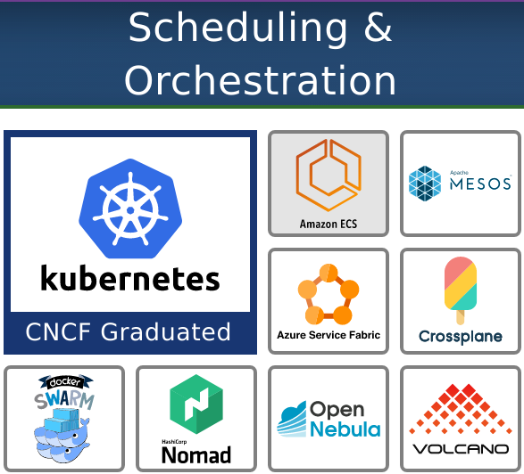
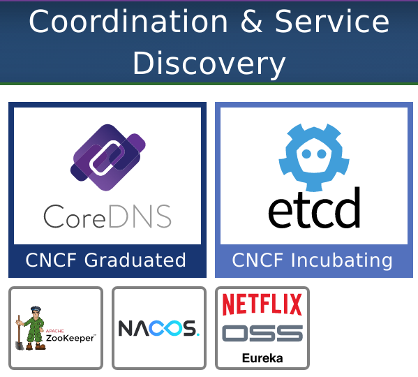
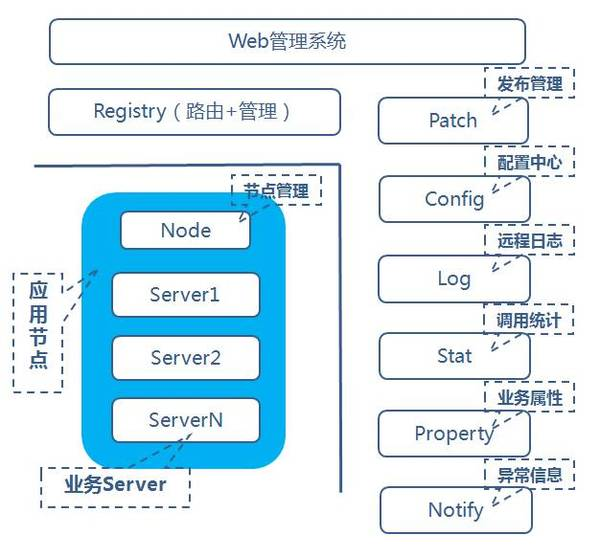
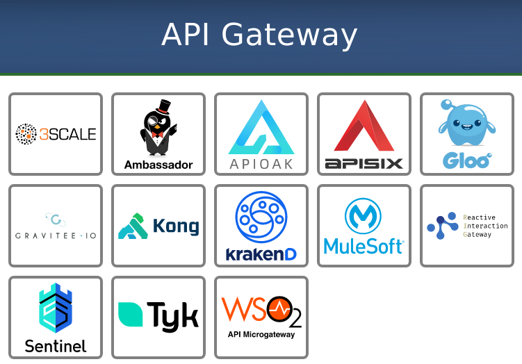

# CNCF Landscape（三）编排和管理层（Orchestration & Management）

前置知识：[《CNCF简介（零）》](CNCF.md)

## 编排和调度（Orchestration & scheduling）

编排和调度是指在集群中运行和管理容器，这是一种新颖的打包和推送应用程序的方式。

容器编排器在某种程度上类似于笔记本电脑上的操作系统（OS），它可以管理所有应用程序（例如Microsoft 360，Slack，Zoom等）。操作系统执行你要使用的应用程序，并计划哪个应用程序何时使用电脑的CPU和其他硬件资源。

虽然在一台机器上运行所有功能都很棒，但是当今大多数现代应用程序都是分布式的，并且需要能够管理在几十个甚至几百个计算机上运行的所有组件。简而言之，你需要一个“集群操作系统”。这就是编排工具的用武之地。

在大多数情况下，Kubernetes也是容器协调器。容器和Kubernetes都是云原生架构的核心，这就是为什么我们如此了解它们的原因。

### 解决的问题：服务很多，无法手动部署

在云原生架构中，应用程序被分解为多个小组件或服务，每个组件或服务都放置在一个容器中。你可能听说过它们被称为微服务。现在，你不再拥有一个大型应用程序，而是拥有多个小型服务，每个服务都需要资源，监视和问题修复。虽然为单个服务手动执行这些操作是可行的，但是当你拥有数百个容器时，你将需要自动化的流程。

### 解决问题的方法

容器协调器使容器管理自动化。Kubernetes是事实上的容器编排器。

Kubernetes做一些所谓的理想状态和解。工程师在文件中指定所需状态，并与实际状态进行连续比较。如果期望状态和实际状态不匹配，Kubernetes会通过创建或销毁对象来协调它们。

### 具体软件

Kubernetes与其他容器协调器（例如Docker Swarm和Mesos）一起位于编排和调度部分。它的基本目的是允许你将多个不同的计算机作为一个资源池进行管理。最重要的是，它允许你以声明性的方式管理它们，即，不是告诉Kubernetes如何做某事，而是提供了你要完成的工作的定义。这使你可以在一个或多个YAML文件中维护所需的状态，并将其应用于任何Kubernetes集群。然后，协调器本身会创建缺失的内容或删除不应该存在的任何内容。

#### Kubernetes vs MESOS vs Docker Swarm

[《为什么Kubernetes天然适合微服务？》](../Kubernetes/K8S微服务性.md)

[《【转载】Introduction to Apache Mesos and Mesosphere DCOS》](Mesos.md)

[《从IT运维到大数据分析到应用开发——Docker Swarm, DCOS, Kubernetes演进过程》](横向比较.md)

[《Docker Swarm, Kubernetes, DCOS架构横向比较》](横向比较2.md)

## 协调和服务发现（Coordination and service discovery）

现代应用程序由多个单独的服务组成，这些服务需要进行协作才能为最终用户提供价值。
* 为了进行协作，他们需要通过网络进行通信。
* 为了进行通信，他们必须首先相互定位。

服务发现是弄清楚该如何做的过程。

### 解决的问题：服务变化快

云原生体系结构是动态的，可变的，这意味着它们在不断变化。

* 当一个容器在一个节点上崩溃时，一个新的容器会在另一个节点上替换它。
* 当应用扩展时，副本将散布在整个网络中。没有一个地方可以提供特定服务。

**一切的位置在不断变化。** 服务发现工具跟踪网络中的服务，以便服务可以在需要时找到彼此。

### 解决问题的方法

使用一个全局唯一的服务注册与发现中心查找和标识单个服务：
* 服务发现引擎：存储存在哪些服务以及如何定位它们的信息
* 名称解析工具：接收服务位置请求并返回网络地址信息

### 具体软件

#### CNCF毕业项目：CoreDNS

CoreDNS是Golang编写的一个插件式DNS服务器，是Kubernetes 1.13 后所内置的默认DNS服务器。CoreDNS 的目标是成为 Cloud Native（云原生）环境下的 DNS 服务器和服务发现解决方案。核心域名系统通过Kubernetes插件与Kubernetes集成，或者通过etcd插件直接与etcd集成。

#### CNCF孵化项目：etcd

etcd是CoreOS团队于2013年6月发起的开源项目，它的目标是构建一个高可用的分布式键值(key-value)数据库。etcd内部采用raft协议作为一致性算法，etcd基于Go语言实现。

etcd比较多的应用场景是用于服务发现。基于 Raft 算法（目前最稳定、功能丰富的共识算法之一）的 etcd 天生就是强一致性、高可用的服务存储目录。用户可以在 etcd 中注册服务，并且对注册的服务配置 key TTL，定时保持服务的心跳以达到监控健康状态的效果。

[《etcd简介》](../数据库/etcd.md)

## 远程过程调用（RPC）

远程过程调用（RPC）是一种使应用程序能够相互通信的技术。

### 解决的问题：解决分布式系统中的服务间远程调用

远程调用时，要能够像本地调用一样方便，让调用者感知不到远程调用的逻辑。

### 解决问题的方法

RPC提供了解决服务之间通信的紧密耦合方式。它的通信高效，并且许多语言支持RPC接口实现。

### 具体软件

#### CNCF孵化项目：gRPC

gRPC从本质上讲就是一个基于HTTP2.0的RESTful API

gRPC和restful API都提供了一套通信机制，用于server/client模型通信，而且它们都使用http作为底层的传输协议。不过gRPC还是有些特有的优势：
* gRPC可以通过protobuf来定义接口，从而可以有更加严格的接口约束条件。关于protobuf可以参见笔者之前的小文Google Protobuf简明教程
* 另外，通过protobuf可以将数据序列化为二进制编码，这会大幅减少需要传输的数据量，从而大幅提高性能。
* gRPC可以方便地支持流式通信
  * 理论上通过http2.0就可以使用streaming模式, 但是通常web服务的restful api似乎很少这么用，通常的流式数据应用如视频流，一般都会使用专门的协议如HLS，RTMP等，这些就不是我们通常web服务了，而是有专门的服务器应用。）

#### 来自国内的项目：TARS

TARS 是将腾讯内部使用的微服务架构 TAF（Total Application Framework）多年的实践成果总结而成的开源项目。目前该框架在腾讯内部，有 100 多个业务（如手机浏览器、应用宝、手机管家、手机QQ、手机游戏等）、1.6 多万台服务器上运行使用。

TARS 是基于名字服务使用 TARS 协议的高性能 RPC 开发框架，同时配套一体化的服务治理平台，帮助个人或者企业快速的以微服务的方式构建自己稳定可靠的分布式应用。

#### 来自国内的项目：Dubbo

Dubbo是阿里巴巴公司开源的一款高性能、轻量级的开源Java RPC框架，它提供了三大核心能力：面向接口的远程方法调用，智能容错和负载均衡，以及服务自动注册和发现。

结构：

* Remoting: 网络通信框架，实现了sync-over-async和request-response消息机制
* RPC: 一个远程过程调用的抽象，支持负载均衡、容灾和集群功能
* Registry: 服务目录框架用于服务的注册和服务事件发布和订阅

## 服务代理（Service proxy）

代理的唯一目的是对服务通信施加更多控制，它不会对通信本身添加任何内容。

服务代理是一种工具，用于拦截进出给定服务的流量，对其应用一些逻辑，然后将该流量转发到另一个服务。它本质上充当“中间人”，收集有关网络流量的信息/或对其应用规则。

### 解决的问题：收集流量数据，流量的跟踪、转换、重定向

应用程序应以受控方式发送和接收网络流量。为了跟踪流量并可能对其进行转换或重定向，我们需要收集数据。传统上，启用数据收集和网络流量管理的代码嵌入在每个应用程序中。服务代理使我们能够“外部化”此功能。它不再需要存在于应用程序中。而是将其嵌入平台层（你的应用程序在其中运行）。

这是非常强大的功能，因为它使开发人员可以完全专注于编写应用程序逻辑，而处理流量的通用任务由平台团队管理。通过单个公共位置集中管理和分发全局所需的服务功能（例如，路由或TLS终止），服务之间的通信更加可靠，安全和高效。

### 解决问题的办法：

代理充当用户和服务之间的”看门人”。通过这种独特的定位，代理可以洞悉正在发生的通信类型，他们可以确定将特定请求发送到哪里，甚至完全拒绝该请求。

代理收集关键数据，管理路由（在服务之间平均分配流量或在某些服务发生故障时重新路由），加密连接信息和缓存数据（减少资源消耗）。

### 具体软件

#### CNCF毕业项目：Envoy

Envoy 是专为大型现代 SOA（面向服务架构）架构设计的 L3/L4 filter、L7 代理和通信总线。该项目源于以下理念：

**网络对应用程序来说应该是透明的。当网络和应用程序出现问题时，应该很容易确定问题的根源。**

Envoy 是一个独立进程，设计为伴随每个应用程序服务运行。所有的 Envoy 形成一个透明的通信网格，每个应用程序发送消息到本地主机或从本地主机接收消息，但不知道网络拓扑。在服务间通信的场景下，进程外架构与传统的代码库方式相比，具有两大优点：
* Envoy 可以使用任何应用程序语言。Envoy 部署可以在 Java、C++、Go、PHP、Python 等之间形成一个网格。面向服务架构使用多个应用程序框架和语言的趋势越来越普遍。Envoy 透明地弥合了它们之间的差异。
* 任何做过大型面向服务架构的人都知道，升级部署库可能会非常痛苦。Envoy可以透明地在整个基础架构上快速部署和升级。

Envoy本身只是一个代理程序，通过xDS协议接收配置信息，控制面板需要另外实现。目前有许多不同种类的控制面板实现，比如Istio和下面要讲到的Contour等。

#### CNCF孵化项目：Contour

Contour是一种为Kubernetes Ingress设计的L7代理。

Ingress特性在Kubernetes 1.1中被加入。通常，Ingress Controller都是通过注释或声明来阐述的。随着社区的发展，出现了许多新的部署模式，如蓝绿发布、负载均衡策略、在一个路由后面有多个Kubernetes Service等，用现有的Ingress不好实现。Contour定义了一个叫做`IngressRoute`的Custom Resource Definition (CRD)来做这些事情。

在底层，Contour是通过xDS协议控制Envoy实现上述功能，它可以看作是一种Envoy的控制面板。

## API网关（API gateway）

API网关允许组织将关键功能（例如授权或限制应用程序之间的请求数量）放置到集中管理的位置。它还用作API使用者的通用接口。

通过API网关，组织可以集中控制（限制或启用）应用程序之间的交互并跟踪它们，从而实现诸如退款，身份验证之类的功能，并防止服务被过度使用（也称为速率限制）。

### 解决的问题

尽管大多数容器和核心应用程序都具有API，但API网关不仅仅是API。API网关简化了组织如何管理规则并将规则应用于所有交互。

API网关允许开发人员编写和维护较少的自定义代码。他们还使团队能够查看和控制用户与应用程序本身之间的交互。

### 解决问题的方法

API网关位于用户和应用程序之间。它充当中介，将来自用户的消息（请求）转发给适当的服务。但是在交出请求之前，它会评估是否允许用户执行他们正在尝试做的事情，并记录有关发出请求的用户信息以及发出的请求数量的详细信息。

简而言之，API网关为用户提供了应用程序的单入口点。它还使你可以将原本在应用程序中实现的任务移交给网关，从而节省了开发人员的时间和金钱。

### 具体软件

API网关的工作原理是**拦截对后端服务的调用，执行某种“增值活动”**，例如验证授权，收集指标或转换请求，然后执行其认为适当的任何操作。

API网关是一组下游应用程序的通用入口点，同时提供了一个团队可以在其中注入业务逻辑以处理授权，速率限制和退款的地方。

## 服务网格（Service mesh）

服务网格管理服务之间的流量（即通信）。它们使平台团队能够在集群内运行的所有服务之间统一添加可靠性，可观察性和安全性功能，而无需更改任何代码。

### 解决的问题

在云原生世界中， 随着服务数量的增加，我们必须处理它们之间的交互。除了服务之间的通信外，我们还必须处理整个系统运行状况的**监视，容错，日志记录和遥测功能，处理多点故障等等**。

在服务网格之前，必须将该功能编码到每个单独的应用程序中。

有了Service Mesh，我们**不必使用任何第三方库/组件，就可以在每个微服务中提供与网络相关的通用功能**，例如配置，路由，遥测，记录，断路等。

### 解决问题的方法

服务网格**通过服务代理将集群上运行的所有服务绑定在一起**，从而形成服务网格。这些通过服务网格控制平面进行管理和控制。服务网格允许平台所有者在不要求开发人员编写自定义逻辑的情况下执行常见操作或在应用程序上收集数据。

### 具体软件

#### 服务网格接口规范：SMI(Service Mesh Interface)

SMI涵盖最常见的服务网格功能的规范：

* 流量策略：在服务之间应用身份和传输加密等策略
* 流量遥测：捕获关键指标，例如错误率和服务之间的延迟
* 流量管理：在不同服务之间转移流量

大多数Service Mesh软件都支持SMI。