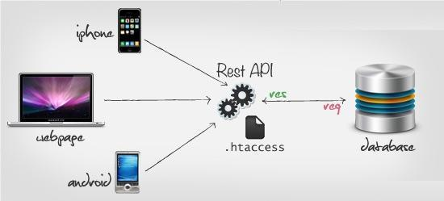

# REST和RESTful API

## REST是什么

REST是表示层状态传输(Representational State Transfer)的缩写。

**REST是一种WEB应用的架构风格**，它被定义为6个限制，满足这6个限制，能够获得诸多优势。

* Client-server architecture：必须是C/S架构
* Statelessness：服务器是无状态的
* Cacheability：
* Uniform interface：
* Layered system：
* Code on demand (optional)：

RESTful API是指具有REST风格的API，可以概括为：

* 用URL定位资源
* 用HTTP动词（GET,HEAD,POST,PUT,PATCH,DELETE）描述操作
* 用响应状态码表示操作结果

## 前后端分离

使用RESTful API架构开发的应用最显著的特征是“前后端分离”，即前端页面和后端服务完全解耦，仅仅通过表示层所传输的“状态”进行沟通。在这样的架构下，网站服务器向前端发送的响应不是HTML文件（即B/S架构，浏览器浏览服务器上的内容），而只是“状态”数据（即C/S架构，客户机操作服务器上的数据），页面生成、渲染和呈现全部由前端完成。因此只要满足数据发送的规则，任何设备和程序都能作为前端，这使得RESTful API架构的应用具有天生的跨平台一致性。

