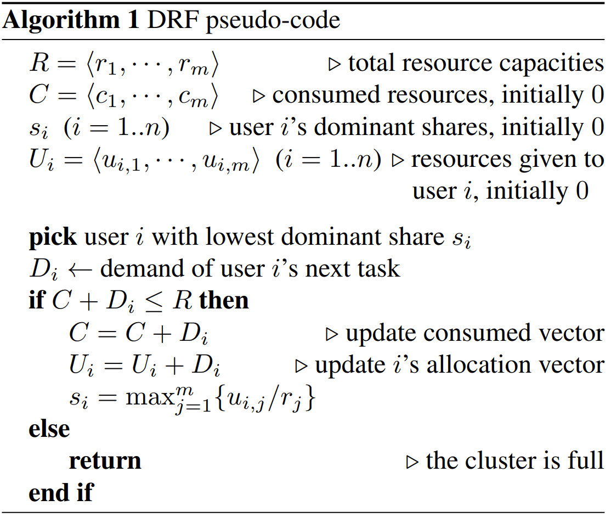
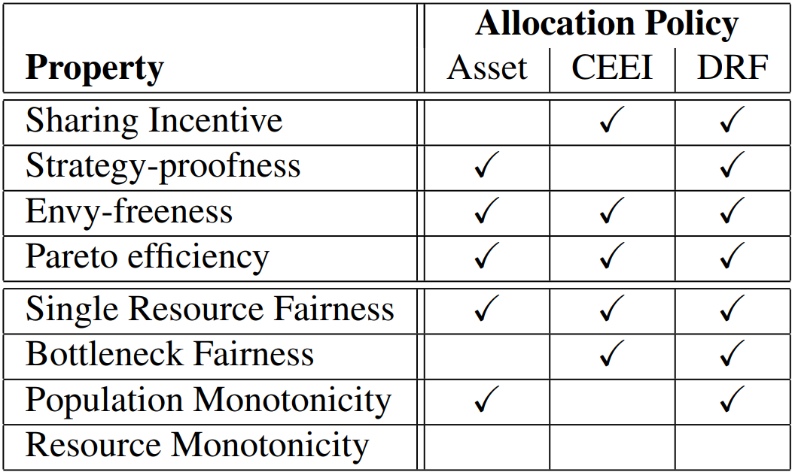
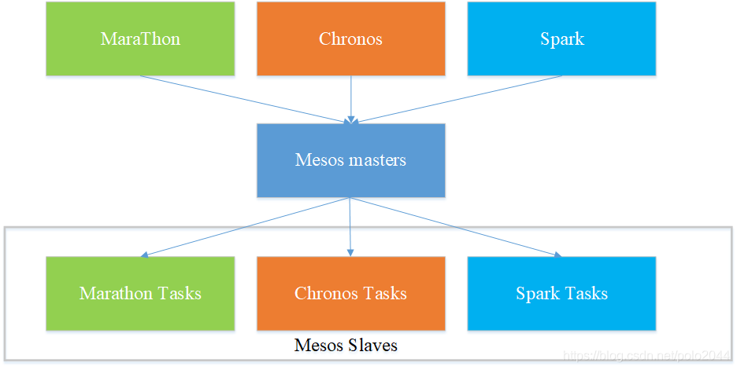
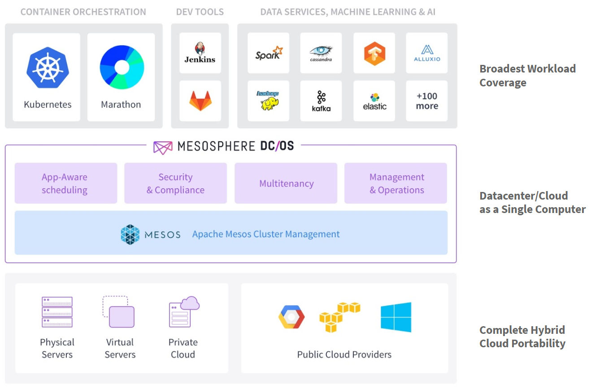

# Mesos和DCOS(Data Center Operating System, 数据中心操作系统)

早在十多年前，Google就开始使用第一代集群管理Borg技术管理数据中心。随后Twitter从Google的Borg系统中得到启发，开发了一个类似的资源管理系统帮助他们摆脱可怕的“失败之鲸”。2009年加州大学伯克利分校AMPLab首先开发出Apache Mesos，这是一款开源集群管理软件，其核心研发成员Benjamin Hindman随后将其引入Twitter，于是Twitter、Facebook、苹果等大型IT企业开始陆续打造各自特色的基于Mesos的数据中心管理方案。

2012年，围绕Mesos开展商业活动的初创公司Mesosphere诞生，而Benjamin Hindman也以Mesosphere首席架构师的身份投身其中。正是该公司提出了基于Mesos的DCOS（数据中心操作系统），希望企业**能像使用一台计算机一样使用整个数据中心。**

## Mesos是什么

**Apache Mesos是为构建和运行其他分布式系统提供服务的分布式系统**。它将CPU 、内存、存储介质以及其它计算机资源从物理机或者虚拟机中抽象出来，构建支持容错和弹性的分布式系统，并提供高效的运行能力。Mesos使用与Linux 内核相同的系统构建原则，只是它们处在不同的抽象层次上。Mesos内核运行在每台机器上，通过应用程序Framework ，提供跨整个数据中心和云环境进行资源管理和调度的API。

## DCOS和Mesos的关系

基于Mesos的DCOS其实是Mesos衍生的生态系统的统称。除了Mesosphere公司的DCOS之外，各大互联网公司基本都有自己的基于Mesos的DCOS系统。

值得一提的是，像Twitter、Airbnb、苹果这样的大公司几乎都是自己搭建基于Mesos的基础设施。但开源的Mesos是一项非常尖端的技术，**通过开源工具手工装配，并将Mesos用于生产环境是非常高难度的**。这也是Mesosphere DCOS的价值所在。Mesosphere推出的DCOS，具备和Twitter、苹果公司同等的能力和自动化效果。

## Mesos在数据中心系统层次中的位置

* PaaS系统运行于Mesos之上
* Mesos运行于IaaS系统之上

如下图所示：

目前已有不少分布式系统直接构建于Mesos之上，包括Apache Spark，Apache Aurora，Airbnb的Chronos以及Mesosphere的Marathon等。此外还有多个流行系统与Mesos相连并运行于其上，如Apache Hadoop，Apache Storm，Google的Kubernetes等。

## Mesos核心技术：两级调度机制

### 结构

* 第一级调度：资源调度
  * 集群由物理服务器或虚拟服务器组成，用于运行应用程序的任务，比如图中的Hadoop和MPI作业
  * Master主机上的守护进程负责管理资源
  * Slave主机上的守护进程负责向Master主机上报资源信息
* 第二级调度：任务调度
  * 每种Framework由相应的应用集群管理，比如上图中的Hadoop和MPI两种Framework
  * Framework有一个集中式的调度器（Scheduler）负责任务调度
  * 每个Slave主机上都有一个或多个执行器（Executor）负责任务的执行
* 两级调度间的衔接
  * 每个Slave主机上都有一个Manager负责接收执行的指令启动执行器执行任务
    * 对于Manager而言，他看到的所有Executor、Task都是一致的容器，而不管这些任务具体执行什么样的业务逻辑

### 过程

1. （第一级调度）Slave 1向Master汇报其空闲资源：4个CPU、4GB内存
2. （第一级调度）Master向Framework 1发送资源邀约：Slave 1上的可用资源有4个CPU、4GB内存
3. （第二级调度）Framework 1的调度器（Scheduler）响应Master：需要在Slave上运行两个任务，第一个任务分配<2 CPUs, 1 GB RAM>资源，第二个任务分配<1 CPUs, 2 GB RAM>资源。
4. （第二级调度）Master向Slave下发任务，分配适当的资源给Framework的任务执行器（Executor），接下来由执行器启动这两个任务
5. （第一级调度）此时，还有1个CPU和1GB的RAM尚未分配，回到第2步，向Framework 2发送资源邀约：Slave 1上的可用资源：1个CPU、1GB内存

在实际系统中，显然Mesos无法知道用户的任务什么时候来，因此在没有任务到来的时候，步骤1和步骤3是一直在定期运行的：

* （第一级调度，步骤1）集群中的所有slave节点会和master定期进行通信，将自己的资源信息同步到master，master由此获知到整个集群的资源状况
* （第二级调度，步骤3）mater会和已注册、受信任的Framework进行交互，定期将最新的资源情况发送给Framework

当用户提交了计算任务，Framework就能直接依据资源信息向slave发起任务启动命令，开始调度工作。

## Mesos调度机制的理论基础

### DRF(Dominant Resource Fairness, 主导资源公平算法)

[Ghodsi A, Zaharia M, Hindman B, et al. Dominant Resource Fairness: Fair Allocation of Multiple Resource Types[C]//Nsdi. 2011, 11(2011): 24-24.](../论文笔记/DRF2011.md)

#### 核心概念

* Task：在系统中执行的计算任务，每个计算任务都需要消耗固定量的Resource
  * 每个用户可以向系统发出不同的Task请求
  * 一个Task可以运行多个副本
  * 系统要使每个Task运行尽可能多的副本
* Resource：系统中可供Task使用的资源，例如CPU和内存等
* Dominant Resource：Task所请求的多种资源中，请求量与资源总量之比最大的那一项资源
* Dominant Share：在资源分配完成后Task的Dominant Resource占用量与资源总量之比
* Equalize Dominant Share：DRF算法最重要的限制条件，要求所有Task的Dominant Share相等

#### 优化目标

例如，一个有9个CPU和18G内存的系统；一个用户提交了一个Task 1，每个Task副本需要一个CPU和4GB内存，即<1CPU,4GB>；另一个用户提交了一个Task 2，每个副本需要<3CPU,4GB>。

在此情况下，显然两个Task的Dominant Resource分别为内存和CPU，若设Task 1运行副本数为$x$，Task 2运行副本数为$y$，则Equalize Dominant Share为：

$$\frac{4x}{18}=\frac{y}{3}$$

即可得DRF的优化目标：
$$
\begin{aligned}
max(x,y)&\\
subject\ to&\\
x+3y&\leq 9\\
4x+y&\leq 18\\
\frac{4x}{18}&=\frac{y}{3}
\end{aligned}
$$

解得$x=3$和$y=2$，即Task 1运行三个副本，Task 2运行两个副本。最后的资源占用情况为：

#### 运行过程

在实际应用中，DRF的优化结果求解过程是渐进式的：
1. 在未完成分配的Task中选择一个Dominant Share最小的Task
2. 检查系统中的资源余量能否满足需求
   * 若能则启动一个副本，重新计算Task的Dominant Share
   * 若不能则判定此Task分配完成
3. 回到步骤1

#### 优点

DRF相比其他算法的优势如下，具体的分析参考原论文：

### Mesos所使用的分层DRF：Hierarchical DRF

## Mesos一些前进道路（2016年）

### 资源抢占

虽然Kubernetes运行在Framework之上，可以让Kubernetes和其它Framework共享资源，对系统的资源利用率提升有一定帮助，但是当前的主要问题是Mesos对资源抢占的支持不是太好，现在只支持类似于Resource Scavenge的功能：当资源在被使用的时候，如果使用不充分，Mesos会把使用不充分的资源作为可撤销资源，发给Framwork。Framework可以在这些资源上运行一些优先级不是很高的作业，因为可撤销资源随时可能因为资源的回收而出发杀掉作业的动作。

但是仅仅有这种Resource Scavenge的功能是远远不够的，因为在Mesos集群还可能有大量其它的资源未被使用。例如Reserved(独占)的资源或者Quota(配额)的资源，这些资源目前只能供某个Role/Framework使用，但是如果这些被某个Role/Framework Reserve的资源或者Quota的资源，在当前这个Role/Framework的负载不是很高的情况下，是没办法让其它的Role/Framework去使用的，所以这部分资源就浪费了。

Mesos社区正在通过两个项目来对上述情况做一些改进：Optimistic Offer(MESOS-1607)和Multiple Role Framework (MESOS-1763)。

Optimistic Offer主要是让不同Role/Framework之间的资源能够相互的借入，借出。例如可以将一些使用率不高的Role/Framework的资源借给其它的Role/Framework去使用，如果借出资源的Role/Framework资源请求增大时，可以将借出的资源回收。

Multiple Role Framework主要是让一个Framework可以使用多个Role上提供的资源，如果这个功能实现的话，可以在Kubernetes的Framwork上设置多个Role，通过Optimistic Offer来让不同Role的资源共享。

### Containizer容器化

Mesos的起步早在容器技术爆火之前，它显然不会去支持一个不存在的服务。但现如今Mesos也成为了容器化革命的浪潮中的一份子。Mesos Containizer就是Mesos容器化的成果之一。

## Mesos+Marathon

### 为什么Mesos需要Marathon

Mesos本身只是一种资源管理框架，讲白了，mesos只能提供了如下几种主要的能力：

* 告诉你有当前数据中心总共有多少CPU，内存，硬盘
* 提供一系列的接口，提供应用程序下发、执行、资源配额设置

为什么说Mesos是个框架软件呢？因为，Mesos并不做编排管理，编排(orchestration)的策略和逻辑需要另一个程序协助完成，Mesos将编排的逻辑开放给其他程序来做，这个程序就额是Mesos中的Framework。

Mesos之所以将编排的任务交出来，是因为编排的需求是发散的，无法收敛。比如：考虑到高可用，会部署同一个应用程序的多个实例，这些实例需要跨虚拟机，还是物理机，甚至是机架、机房？这个编排是根据具体的需求定的，无法一概而论。

Mesos的这种架构就是文章一开头所说的：

>**Apache Mesos是为构建和运行其他分布式系统提供服务的分布式系统**

Marathon就是这样一种编排系统，它实现了服务发现和负载平衡、为部署提供REST API服务、授权和SSL、配置约束等功能，支持通过Shell命令和Docker部署应用，提供Web界面、支持cpu/mem、实例数等参数设置，支持单应用的Scale，但不支持复杂的集群定义。Marathon能够支持运行长服务，比如Web应用等。Marathon能够原样运行任何Linux二进制发布版本，比如Tomcat Play等。

如果将Mesos类比为操作系统的内核，负责资源调度。则Marathon可以类比为服务管理系统，比如init，systemd或upstart等系统，用来管理应用的状态信息。Marathon将应用程序部署为长时间运行的Mesos任务。

### Marathon核心功能简介

Marathon核心功能就是“编排”，即管理应用的状态信息。它根据用户的需求生成一系列的Task，通过Framework的API交给Mesos运行，并通过Mesos的相关API实时地监测Task运行的状态并及时做出响应。

比如，Marathon可以指定每个应用程序需要的资源以及要运行此程序需要多少实例。它可以使用的集群资源对失败的任务自动做出响应。如果某个Mesos Slave宕机或应用的某个实例退出、失败，Marathon将会自动启动一个新的实例，来替换掉失败的实例。Marathon也允许用户在部署时指定应用程序彼此间的依赖关系，这样就可以保证某个应用程序实例不会在它依赖的数据库实例启动前启动。

## Mesos+Kubernetes

[Kubernetes on DC/OS](https://d2iq.com/blog/kubernetes-dcos)

[Kubernetes on Mesos](https://blog.csdn.net/karamos/article/details/80122198)

### 为什么要在Mesos上搭建Kubernetes

首先要明确一点：**Mesos+Kubernetes是IaaS服务提供商搭建通用云计算平台的方案**，所面向的场景是**许许多多的用户在同一套设施上运行各自独立的Kubernetes集群**。如果是一个公司内部自己搭建的运行自家软件的计算平台，Kubernetes足矣。

#### 节点自动扩展

一个普通的Kubernetes集群会包含若干台Master和Worker节点，这些都需要用户手动或者通过脚本去安装，如果想实现Kubernets Auto Scaling的话，需要将Kubernetes部署在一个IaaS的云平台之上，通过云平台对Kubernetes提供资源，同时对Kubernets监控，根据负载进行自动扩展，但是Kubernetes和云平台的集成稍显厚重。

Kubernetes和Mesos集成完成之后，也可以实现Worker节点的自动扩展，所有Worker节点都是自动创建的，不需要用户手动干预。

#### Kubernets与Mesos中原有的其他非Kubernetes服务自动集成

并不是所有的应用都是适合使用Kubernetes部署的，总有一些Kubernetes干不来的活，比如数据库和存储这类不能微服务化的应用。

一旦Mesos和Kubernetes集成完成之后，Kubernetes会作为Mesos的一个Framework运行在Mesos之上。因为一个Mesos可以同时为多个Framework提供资源，当Kubernetes作为Mesos的一个Framework之后，Mesos就可以实现Kubernetes和其它Framework之间的资源共享。

### 原理

在Kuberntes与Mesos的集成中，Kubernetes的Scheduler会作为Mesos的Framework对Pod与Offer进行匹配；而Kubernetes 的 kubelet 与 kube-proxy则会被新增加的Mesos Executor进行管理来启动相应的Worker并对网络进行配置，从而达到动态扩容的需求。

## DCOS案例

### Mesosphere DCOS

>Mesosphere DCOS除了内核Mesos，还有两个关键组件Marathon和Chronos。其中，Marathon（名分布式的init）是一个用于启动长时间运行应用程序和服务的框架，Chronos（又名分布式的cron）是一个在Mesos上运行和管理计划任务的框架。

>Mesosphere DCOS 可以运行在任意的现代Linux环境，公有或私有云，虚拟机甚至是裸机环境，当前支持的平台有亚马逊AWS，谷歌GCE，微软Azure，Openstack等等。据Mesosphere官网显示，Mesosphere DCOS在其公有仓库上已提供了40多种服务组件，比如Hadoop，Spark，Cassandra, Jenkins, Kafka, MemSQL等等。

### 浙江移动与天玑联合研发的DCOS

>2016年，浙江移动凭借一条“DCOS发力双11”的新闻成功火了一把，主要是讲他们自己搭建了一套基于开源Mesos + Doker技术的DCOS（数据中心操作系统），而且很魄力地将一个服务于上千万用户的重要生产系统迁移其上，同时后端搭配天玑数据PBData数据库云平台的强劲支撑，最终完美度过了今年 “双11”秒杀的高峰压力。一时间“DCOS”这个词迅速引发业内围观。

可以很明显地看出，这个DCOS与典型的Mesos+Kubernetes方案非常类似。此DCOS融合了Mesos和Docker，在Mesos的基础上实现了一个类似Kubernetes的服务注册和引流的结构。Mesos与Docker的结合极大简化业务运维复杂度，实现自动化部署与应用程序升级，Mesos还可为资源管理提供高容错性，自动辨别服务器、机架或网络出现的故障等。

### 苹果公司基于Mesos重建的Siri后端服务DCOS

在MesosCon 2015上，苹果公司分享了在生产环境中使用Mesos的经验。原来苹果用了近一年时间从原有的基于VM的环境迁移到基于Mesos的环境。他们使用Apache Mesos重建了个人助理软件Siri的后端服务，并创建了一个名为J.A.R.V.I.S.而且类似PaaS的专有调度Framework，由此，开发者可以部署可伸缩和高可用的Siri服务。据说其Mesos集群规模保守估计有10,000个节点，支持Siri应用程序的后台系统包括约100种不同类型的服务，应用程序的数据则存储在Hadoop分布式文件系统（HDFS）中。从基础设施的角度来看，使用Mesos 有助于使Siri具备可伸缩性和可用性，并且还改善了iOS 应用程序自身的延迟。

## 总结

随着云计算的快速普及，Docker为代表的容器技术如火如荼，企业用户越来越关注基于云计算的下一代IT架构变革，而软件定义数据中心（SDDC）的理念也逐渐被接收。Mesos技术正是在这样的大环境下应运而生，有了基于Mesos的数据中心操作系统，企业可以方便地对数据中心资源进行统一管理，这无疑是IT架构质的飞跃。相信不远的未来，以Mesos为代表的一系列SDDC技术将成为业内的新热点。