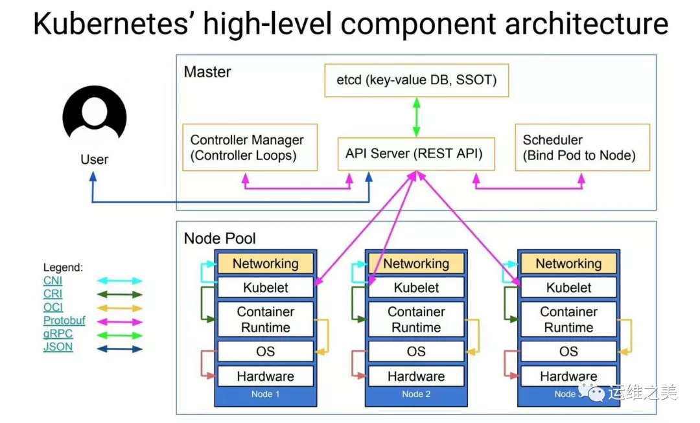
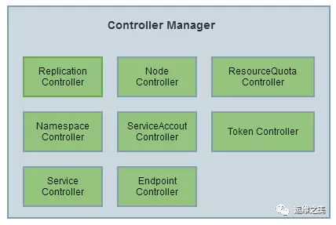
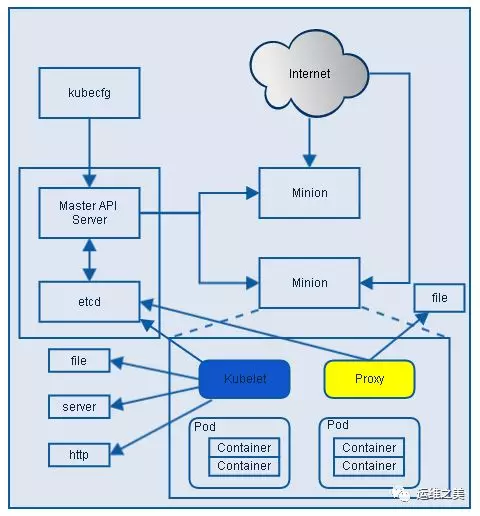

# Kubernetes(k8s)的结构

[教程参考](https://juejin.im/post/5b63f4506fb9a04f8856f340)
[教程参考](https://www.huweihuang.com/article/kubernetes/kubernetes-architecture/)

k8s有集群中的节点有控制节点和工作节点之分。控制节点负责运行容器，工作节点负责控制工作节点容器的调度和运行。

注意：

* k8s并不是在Docker基础上开发而来的容器调度工具，只要是符合CNI接口标准的容器服务都可以作为k8s在容器层的“驱动程序”
* k8s和Docker虽然运行在两个完全不同的层次，但是其功能有重合之处，存在部分竞争关系（运行k8s还不必须要有Docker，结果就导致[《Docker 麻烦大了》](https://zhuanlan.zhihu.com/p/85560091)）。比如k8s就没有使用Docker的端口映射和DNS功能，而是使用自己的iptables和DNS功能（kube-proxy和kube-dns）。

```mermaid
graph TD
用户-->kubectl-->|控制|控制节点
k8s[Kubernetes]-->控制节点
控制节点-->ETCD
控制节点-->kube-apiserver
控制节点-->kube-scheduler
ControllerManager-->kube-controller-manager
ControllerManager-->cloud-controller-manager
kube-controller-manager-->ReplicationController[Replication Controller]
kube-controller-manager-->NodeController[Node Controller]
kube-controller-manager-->DeploymentController[Deployment Controller]
kube-controller-manager-->AdmissionController[Admission Controller]
控制节点-->ControllerManager[Controller Manager]-->|控制|网络化组件
k8s-->工作节点
工作节点-->容器平台
工作节点-->网络化组件
工作节点-->kube-proxy
工作节点-->kube-dns
```

## 控制节点 Control-plane node

以下介绍在控制节点上运行的k8s组件。

### ETCD

Etcd 是 CoreOS 基于 Raft 开发的分布式 key-value 存储，可用于服务发现、共享配置以及一致性保障（如数据库选主、分布式锁等）。

kubernetes需要存储很多东西，像它本身的节点信息，组件信息，还有通过kubernetes运行的pod，deployment，service等等。都需要持久化。etcd就是它的数据中心。生产环境中为了保证数据中心的高可用和数据的一致性，一般会部署最少三个节点。

### API Server

kube-apiserver是Kubernetes最重要的核心组件之一，主要提供以下的功能

* 提供集群管理的REST API接口，包括认证授权（我们现在没有用到）数据校验以及集群状态变更等
* 提供其他模块之间的数据交互和通信的枢纽（其他模块通过API Server查询或修改数据，只有API Server才直接操作etcd）

### Controller Manager

Controller Manager由kube-controller-manager和cloud-controller-manager组成，是Kubernetes的大脑，它通过apiserver监控整个集群的状态，并确保集群处于预期的工作状态。

kube-controller-manager由一系列的控制器组成：

#### Replication Controller

Replication Controller 的作用主要是定期关联 Replication Controller (RC) 和 Pod，以保证集群中一个 RC (一种资源对象) 所关联的 Pod 副本数始终保持为与预设值一致。

#### Node Controller

Kubelet 在启动时会通过 API Server 注册自身的节点信息，并定时向 API Server 汇报状态信息。API Server 在接收到信息后将信息更新到 Etcd 中。

Node Controller 通过 API Server 实时获取 Node 的相关信息，实现管理和监控集群中的各个 Node 节点的相关控制功能。

#### ResourceQuota Controller

资源配额管理控制器用于确保指定的资源对象在任何时候都不会超量占用系统上物理资源。

#### Namespace Controller

用户通过 API Server 可以创建新的 Namespace 并保存在 Etcd 中，Namespace Controller 定时通过 API Server 读取这些 Namespace 信息来操作 Namespace。

比如：Namespace 被 API 标记为优雅删除，则将该 Namespace 状态设置为 Terminating 并保存到 Etcd 中。同时 Namespace Controller 删除该 Namespace 下的 ServiceAccount、RC、Pod 等资源对象。

#### Service Account Controller

Service Account Controller (服务账号控制器)，主要在命名空间内管理 ServiceAccount，以保证名为 default 的 ServiceAccount 在每个命名空间中存在。

#### Token Controller

Token Controller（令牌控制器）作为 Controller Manager 的一部分，主要用作：监听 serviceAccount 的创建和删除动作以及监听 secret 的添加、删除动作。

#### Service Controller

Service Controller 是属于 Kubernetes 集群与外部平台之间的一个接口控制器，Service Controller 主要用作监听 Service 的变化。

比如：创建的是一个 LoadBalancer 类型的 Service，Service Controller 则要确保外部的云平台上对该 Service 对应的 LoadBalancer 实例被创建、删除以及相应的路由转发表被更新。

#### Endpoint Controller

Endpoints 表示了一个 Service 对应的所有 Pod 副本的访问地址，而 Endpoints Controller 是负责生成和维护所有 Endpoints 对象的控制器。

Endpoint Controller 负责监听 Service 和对应的 Pod 副本的变化。定期关联 Service 和 Pod (关联信息由 Endpoint 对象维护)，以保证 Service 到 Pod 的映射总是最新的。

默认情况下，k8s组件和节点间的通信建立在不安全的HTTP连接之上，如果要使用安全的连接（在跨区域集群方案或者混合云方案中使用），本文中所介绍的所有组件都要加上证书进行TLS改造。

### cloud-controller-manager

cloud-controller-manager在Kubernetes启用Cloud Provider的时候才需要，用来配合云服务提供商的控制。

>controller-manager、scheduler和apiserver 三者的功能紧密相关，一般运行在同一个机器上，我们可以把它们当做一个整体来看，所以保证了apiserver的高可用即是保证了三个模块的高可用。也可以同时启动多个controller-manager进程，但只有一个会被选举为leader提供服务。

### Scheduler

kube-scheduler负责分配调度Pod到集群内的节点上，它监听kube-apiserver，查询还未分配Node的Pod，然后根据调度策略为这些Pod分配节点。我们前面讲到的kubernetes的各种调度策略就是它实现的。

## 工作结点 Worker node

### 一个容器平台

容器平台是指像Docker这样的容器运行程序，类似的容器平台还有Podman等。在运行时受容器网络化组件的控制，在容器网络化组件中也被称为“容器驱动”(Container Driver)。

### 一个实现了CNI接口的容器网络化组件

CNI（Container Network Interface）是CNCF旗下的一个项目，由一组用于配置Linux容器的网络接口的规范和库组成，同时还包含了一些插件。CNI仅关心容器创建时的网络分配，和当容器被删除时释放网络资源。

Kubernetes源码的vendor/github.com/containernetworking/cni/libcni目录中已经包含了CNI的代码，也就是说kubernetes中已经内置了CNI，只要是支持CNI的容器网络组件都可以部署在Kubernetes工作节点。

k8s调度容器的方式就是从控制节点调用工作节点CNI接口，进而通过容器网络化组件控制每个工作节点中的容器平台。

常见的兼容CNI接口的容器网络化组件有flannel，calico，weave等。

[CNI插件相关知识简介](./CNI插件相关知识简介.md)

### kubelet

每个工作节点上都运行一个kubelet服务进程，默认监听10250端口，接收并执行master发来的指令，管理Pod及Pod中的容器。每个kubelet进程会在API Server上注册节点自身信息，定期向master节点汇报节点的资源使用情况，并通过cAdvisor监控节点和容器的资源。

### kube-proxy

每台工作节点上都应该运行一个kube-proxy服务，它监听API server中service和endpoint的变化情况，并通过iptables等来为服务配置负载均衡，是让我们的服务在集群外可以被访问到的重要方式。

### kube-dns

kube-dns为Kubernetes集群提供命名服务，主要用来解析集群服务名和Pod的hostname。目的是让pod可以通过名字访问到集群内服务。它通过添加A记录的方式实现名字和service的解析。普通的service会解析到service-ip。headless service会解析到pod列表。

## kubeadm

kubeadm是Kubernetes官方提供的用于快速安装Kubernetes集群的工具。如果没有这个工具，k8s的集群安装会非常麻烦。

非官方的集群安装工具其实也很多，比如lops、KRIB、Kubespray等，Windows上面也有Docker Desktop可以搞k8s。
