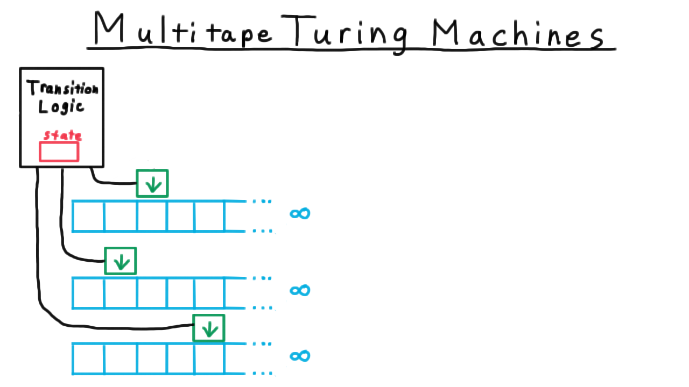

# 图灵机

图灵机(Turing Machine, TM)~~是 Alan Turing **从自己多年设计制造计算机的经验中抽象出的**一种计算模型~~。它在自动机领域也只是大大小小机器中的一个，但因其与现实中的

## 确定的图灵机的形式化定义

$$M=(Q,\Sigma,\Gamma,\delta,q_0,B,F)$$

* $Q$：有穷状态集
* $\Sigma$：字母表（有穷输入符号集）
* $\Gamma$：所有可以放置在输入字符串中的字符（有穷带符号集），$\Sigma\in\Gamma$包含字母表和空格符号
* $\delta$：状态转移函数，$\delta:Q\times\Gamma\rightarrow Q\times\Gamma\times\{L,R\}$
* $q_0$：初始状态，$q_0\in Q$
* $B$：空格符号，$B\in\Gamma-\Sigma$
* $F$：终结状态集（接受状态集），$F\subseteq Q$

状态转移函数$\delta$表示当前状态和输入符号的笛卡尔积到下一个状态、写入符号和移动方向的映射；它的输入是当前状态+字符串中的一个符号，输出下一个状态+要将字符串中的当前符号改变为什么符号+接下来读取该字符左边还是右边的字符（不能停止不动，字符串向左向右都是无限长）。

当图灵机到达$F$中的某个状态时结束。

例如$(q_1,Y,L)=\delta(q_0,X)$表示当前状态为$q_0$、当前读取的字符为$X$，然后图灵机的状态改变为$q_1$、将当前字符修改为$Y$、接下来读取左边的字符（“$L$”）。在状态转移图中表示为：
```mermaid
graph LR
q0((q0))--X/Y <- -->q1((q1))
```

## 可计算函数：图灵机为何特殊

## 确定的图灵机的瞬时描述(Instantaneous Description, ID)

图灵机的输入虽然是有限长，在有限步内所到达的字符串的非空内容总是有限的，因此可以使用字符串和状态$q$以及$q$在字符串上的位置定义图灵机的瞬时描述：
$$X_1X_2...X_{i-1}qX_iX_{i+1}...X_n$$
* $q$为图灵机的当前状态
* $i$为图灵机当前读取的位置
* $X_i,i\in[1,n]$为图灵机在有限步内所到达的字符串的非空内容

### ID转移：$\vdash$

在图灵机$M$中，$(q_1,Y,L)=\delta(q_0,X)$的ID转移表示为：
$$X_1X_2...X_{i-1}q_0X_iX_{i+1}...X_n\vdash_MX_1X_2...X_{i-2}q_1X_{i-1}YX_{i+1}...X_n$$

在图灵机$M$中，$(q_1,Y,R)=\delta(q_0,X)$的ID转移表示为：
$$X_1X_2...X_{i-1}q_0X_iX_{i+1}...X_n\vdash_MX_1X_2...X_{i-1}Yq_1X_{i+1}X_{i+2}...X_n$$

若某ID$I_1$是由另一个ID$I_0$经过有限步（包括0步）转移得到的，则记为$I_0\vdash_M^*I_1$。

## 图灵机的语言

某个**图灵机**定义为$M=(Q,\Sigma,\Gamma,\delta,q_0,B,F)$，则所有的可以让$M$通过**有限步**ID转移到接受状态的字符串的集合，称为图灵机$M$的 **语言**：

$$
\bm L(M)=\{w\in\Sigma^*|(\exist p\in F,\alpha\in\Gamma^*,\beta\in\Gamma^*)q_0w\vdash_M^*\alpha p\beta\}
$$

* $L=\bm L(M)$又称为**递归可枚举语言**。
* $L=\bm L(M)\wedge\text{M对所有输入都保证停机}$称为**递归语言**。

注：图灵机不保证对所有字符串输入都停机。保证停机的图灵机在实际应用中是算法的好模型，是算法概念的形式化。

## 图灵机变种

**以下的图灵机都可证明与确定的图灵机等价**，但可以让图灵机的设计更加简单。

### 可以存储有限个符号的图灵机

$$M=(Q',\Sigma,\Gamma,\delta,q_0',B,F)$$

* $Q'=Q\times\Gamma\times...\times\Gamma$：图灵机的状态是由一个状态和多个符号组成的序列（元组）
* $q_0'=[q_0,B,...,B]$：图灵机的初始状态由一个状态和多个空白符组成

### 多道图灵机

$$M=(Q,\Sigma,\Gamma',\delta,q_0,B',F)$$

* $\Gamma'=\Gamma\times\Gamma\times...\times\Gamma$：图灵机的输入不是一个字符串而是一个固定长度的字符元组串

### 半无穷带图灵机

字符串输入只有一侧是无穷的

### 多带图灵机

* 字符串输入有多个
* 图灵机在每个字符串上可以处于不同的位置
* 图灵机在每个字符串上的位置移动相互独立
* 图灵机在字符串上的移动除向左向右外，还可以是停止状态

### 非确定的图灵机(Nondeterministic Turing Machine, NTM)

$$M=(Q,\Sigma,\Gamma,\delta,q_0,B,F)$$

* $\delta$：状态转移函数，$\delta:Q\times\Gamma\rightarrow 2^{Q\times\Gamma\times\{L,R\}}$
  * 类比NDA，NTM的状态转移函数输出为TM状态转移函数输出元组的集合，表示当前所有可能的状态转移过程

## 计算复杂性引入

* **运行时间**：图灵机在某个输入上停机前移动的步数
* **时间复杂度**$T(n)$：图灵机$M$在所有长度为$n$的输入上的运行时间的最大值。

* 只有保证停机的图灵机$T(n)$才有意义
* 只有多项式时间的$T(n)$才能在实际的计算机上可解

上面这些图灵机变种都与确定的图灵机等价，它们都能用来模拟确定的图灵机（显然），也都能被确定的图灵机所模拟。接下来看看如何模拟并分析一下模拟的时间复杂度。

### 用确定的图灵机模拟可以存储有限个符号的图灵机

显然，令确定的图灵机的状态集合为可以存储有限个符号的图灵机的所有可能的状态和存储符号的组合即可。模拟移动$n$步的时间复杂度为$O(n)$。

### 用确定的图灵机模拟多道图灵机

显然，令确定的图灵机的输入为字符元组就是一个多道图灵机了。模拟移动$n$步的时间复杂度为$O(n)$。

### 用确定的图灵机模拟可以存储有限个符号的多道图灵机

显然，令确定的图灵机的状态集合为可以存储有限个符号的图灵机的所有可能的状态和存储符号的组合，并令其输入为字符元组即可。模拟移动$n$步的时间复杂度为$O(n)$。

### 用可以存储有限个符号的多道图灵机模拟多带图灵机

思路：对于$k$带图灵机，用$2k$道图灵机模拟之。对于每个带，都用两个道模拟，一个道存带的内容，一个道存图灵机在当前带的位置。

1. 从左到右扫描一次，存储图灵机在所有带的位置和对应位置的输入
2. 执行状态转移函数，存储图灵机在所有带的移动状态和要修改动作
3. 从右到左扫描一次，按照移动状态修改道上的位置记录、按照修改动作修改道上的数据
4. 重复1~3直到可接受状态

模拟移动1步需要左右扫描一次，时间复杂度$O(n)$，因此模拟移动$n$步的时间复杂度为$O(n^2)$。

### 用多带图灵机$M$模拟NTM$N$：广度优先搜索

思路：同NDA一样，NTM的运行过程也可以看作是树，其节点是ID，分支是由于NTM选择了多个状态转移而产生多个ID转移进而产生多个ID。若要用“串行”的图灵机模拟之，则可考虑对NTM运行时树上的ID进行广度优先搜索。

$M$有两条带，第一条带保存$N$中产生而未处理的ID，第二条带用于对ID进行处理。

1. 把第一条带开头的ID复制到第二条带
2. 若第二条带上的ID可接受则停止
3. 否则将第二条带上的可能的ID转移复制到第一条带的末端
4. 抹去第二条带开头的ID
5. 重复1~4

模拟每个ID都要读取复制和删除长度为$n$的ID，时间复杂度$O(n)$，若每一个ID至多产生$m$个选择，那经过$n$步要模拟$\sum_{i=1}^nm^i=\frac{m^{n+1}-1}{m-1}$个ID，总的时间复杂度为$O(nm^n)$。

### $P=NP$问题

前面分析出来了用NTM能用多带图灵机进行模拟，但模拟需要指数时间，但这只是一种最直观的模拟方法，是否存在多项式时间的模拟方法？目前还是未知的。

这个问题可以概括为：NTM以多项式时间解决的问题，TM是否也可以以多项式时间解决？

简称$P=NP$问题。其中

* $P$表示确定的图灵机在多项式时间内可以解决的问题的问题类
* $NP$表示非确定的图灵机在多项式时间内可以解决的问题的问题类

虽然问题目前还没解决，但是实际应用中通常认为$P\not ={NP}$。

## 图灵机的二进制表示