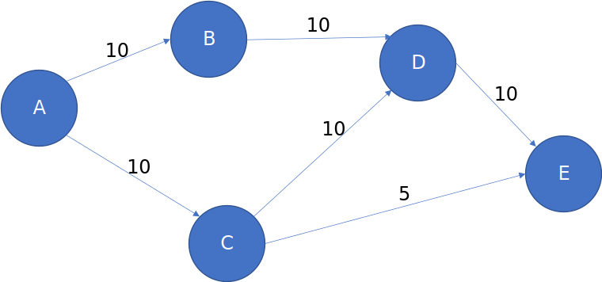
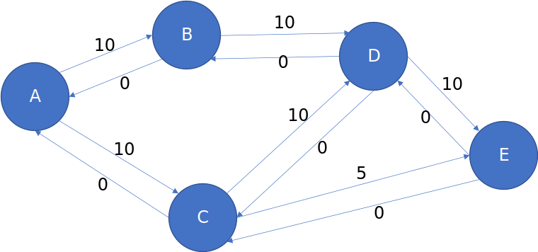

# 最大流算法

## 引入

以[POJ1273](http://poj.org/problem?id=1273)作为引入：

>Description
>
>Every time it rains on Farmer John's fields, a pond forms over Bessie's favorite clover patch. This means that the clover is covered by water for awhile and takes quite a long time to regrow. Thus, Farmer John has built a set of drainage ditches so that Bessie's clover patch is never covered in water. Instead, the water is drained to a nearby stream. Being an ace engineer, Farmer John has also installed regulators at the beginning of each ditch, so he can control at what rate water flows into that ditch.
Farmer John knows not only how many gallons of water each ditch can transport per minute but also the exact layout of the ditches, which feed out of the pond and into each other and stream in a potentially complex network.
Given all this information, determine the maximum rate at which water can be transported out of the pond and into the stream. For any given ditch, water flows in only one direction, but there might be a way that water can flow in a circle.
Input
>
>The input includes several cases. For each case, the first line contains two space-separated integers, N (0 <= N <= 200) and M (2 <= M <= 200). N is the number of ditches that Farmer John has dug. M is the number of intersections points for those ditches. Intersection 1 is the pond. Intersection point M is the stream. Each of the following N lines contains three integers, Si, Ei, and Ci. Si and Ei (1 <= Si, Ei <= M) designate the intersections between which this ditch flows. Water will flow through this ditch from Si to Ei. Ci (0 <= Ci <= 10,000,000) is the maximum rate at which water will flow through the ditch.
Output
>
>For each case, output a single integer, the maximum rate at which water may emptied from the pond.
Sample Input
>
>5 4
>
>1 2 40
>
>1 4 20
>
>2 4 20
>
>2 3 30
>
>3 4 10
>
>Sample Output
>
>50

## 问题描述

已知一个有向图$G(V,E)$和每条边的水流量$W_{i,j}$，求起点到终点之间的最大水流量。

## 思路

### 基本思路：增广路径

显然，从物理上来说，给起点和终点各接上一条水管，不断增大水流量直到有路径刚好溢出，这时的水流量就是最大水流量。体现在程序中就是：随便选一条路径，该路径的流量等于路径上最小边的水流量，从图中减去占用的这部分流量，在剩下的部分重复找路-减流量的过程，最终就能得到最大流量。这里从“剩下的部分”中找到的路径就是我们常说的“增广路径”，找最大流的过程就是不断寻找“增广路径”的过程。

但是，这种方法存在问题，找到的一条从起点到终点的流截断了其他可能的流，比如：

找了ABDE后就会变成：

本来AE之间应该可以传最大15的流的，结果被一条10的流断了。

如何消除这种错误？为了选上那条为5的边，势必要把已选的边流量取消一部分。我们可以把已选的边变成反向边，从而构造出一个新图，在新图的反向边上的流量就是原图上要取消的流量。这种方法就是Ford-Fulkerson算法。

### 用反向边取消不合理的流量：Ford-Fulkerson算法

Ford-Fulkerson算法给每条路径增加一个初值为0的反向路径，当找到一条路径之后，将路径上的边容量全部减去流量，并在对应的反向边上加上同样大的流量，这样构建的网络称为“残余网络”。每次选好流量后都构建残余网络，在残余网络中再找增广路径，直到没有增广路径可找，反向边上的流量就是最大流路径上的流量。

例如，上面的案例初始化残余网络后就成为这样的图：

而选择了那条会阻断流的路径后，残余网络会变成这样：

进而我们又能找到一条ABDCE为5的流，这条流相当于把CD已经选好的流量取消了5改走CE，从而使得ABDE多走了5的流量。按照上述规则再构造残余网络：

我们发现没有增广路径可找了，算法结束。