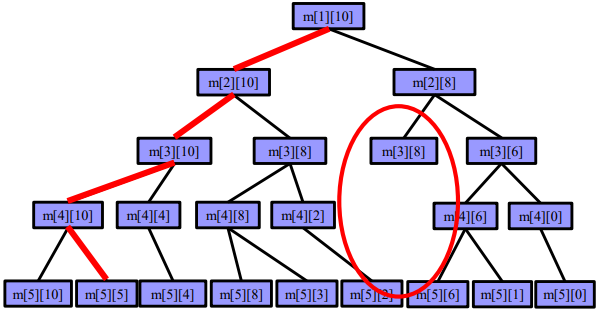
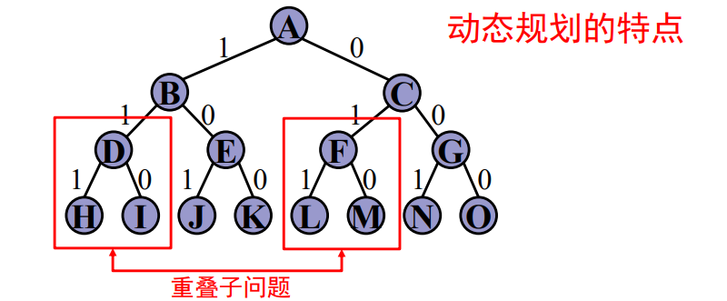
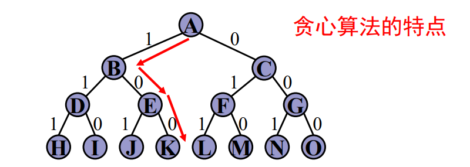
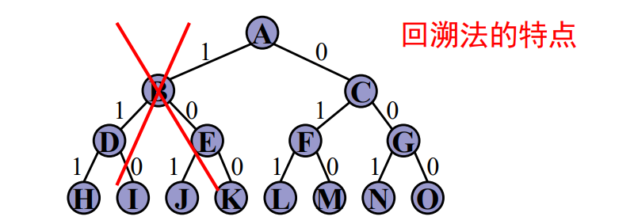

# 算法课复习

## 近似算法

### 为什么需要近似算法
* 求解NP完全问题很难，无法在多项式时间内求解
* 在精度要求不高的场景下次优解也可以达到目的
* 一些NP完全问题的次优解可以使用多项式时间复杂度的算法找到

### 近似算法的概念
* 能够给出一个优化问题的近似最优解的算法
* 一般用于解决优化问题

### 近似算法的近似度

#### Ratio Bound

对于一个问题的最优解$OPT$和近似解$A$，$A$的Ratio Bound定义为$B(n)$：
$$B(n)\geq max\left\{\frac{A}{OPT},\frac{OPT}{A}\right\}$$

该值表征了近似解和最优解之间的比例，Ratio Bound越大，近似解越坏。
* 若问题是最大化问题，则$max\left\{\frac{A}{OPT},\frac{OPT}{A}\right\}=\frac{OPT}{A}\geq 1$
* 若问题是最小化问题，则$max\left\{\frac{A}{OPT},\frac{OPT}{A}\right\}=\frac{A}{OPT}\geq 1$

#### 相对误差

* 相对误差$=\frac{|A-OPT|}{OPT}$
* 相对误差界$\varepsilon(n)\geq\frac{|A-OPT|}{OPT}$

#### 相对误差和Ratio Bound

* $\varepsilon(n)\leq B(n)-1$
  * 对于最小化问题$\varepsilon(n)=\frac{|A-OPT|}{OPT}=\frac{A}{OPT}-1=B(n)-1$
  * 对于最大化问题$\varepsilon(n)=\frac{|A-OPT|}{OPT}=\frac{OPT-A}{OPT}=\frac{B(n)-1}{B(n)}\leq B(n)-1$

## 随机算法

随机算法是一种使用概率和统计方法在其执行过程中对于下一计算步骤作出随机选择的算法。

优点：
* 对于有些问题：算法简单
* 对于有些问题：时间复杂性低
* 对于有些问题：同时兼有简单和时间复杂性低

### 随机数值算法

随机取一些数值，进行一些计算，以逼近真实值。

比如计算定积分：$\int_a^bf(x)dx$：随机取$n$个$[a,b]$中的点$x_i$，分别计算$g(x_i)$，求它们的均值$E(g(x_i))$，$\int_a^bf(x)dx\approx\frac{(b-a)}{n}E(g(x_i))$。时间复杂度$O(n)$，$n$越大精度越高。

### Las Vegas算法

随机取一些数值，计算出一些解，验证解是不是正确的。
* 一旦找到一个解，该解一定是正确的
* 找到解的概率与算法执行时间成正比
* 增加对问题反复求解次数，可使求解无效的概率任意小

比如最简单的，找第$k$小元素：
1. 在$n$个数中随机的找一个数$A[i]=x$, 然后将其余$n-1$个数与$x$比较，分别放入三个数组中：
   * $S_1$(元素均$< x$), $S_2$(元素均$=x$), $S3$(元素均$> x$)
2. 若$|S_1|≥k$ 则调用$Select(S_1,k)$；
3. 若$|S_1|<k$ 但$(|S_1|+|S_2|)≥k$，则第k小元素就是x；
4. 否则有$(|S_1|+|S_2|)< k$，调用$Select(S3,k-|S_1|-|S_2|)$。

若以等概率方法在$n$个数中随机取数，则该算法用到的比较次数的期望值不超过$4n$。

### Sherwood算法

Sherwood算法将一个确定的算法改成一个随机算法：
* 若问题已经有平均性质较好的确定性算法，
* 但是该算法在最坏情况下效率不高，
* 引入一个随机数发生器(通常服从均匀分布)
* 将一个确定性算法改成一个随机算法

比如快速排序在最坏情况效率低，可以将待排序数组进行随机预处理，使输入均匀分布，再运行算法。

### Monte Carlo算法

* 主要用于求解需要准确解的问题
* 算法可能给出错误解
* 获得精确解概率与算法执行时间成正比

#### 主元素问题

若$n$元数组$T$中一半以上元素都是$x$，则$x$是$T$的主元素。如何找出数组T的主元素？

* 精确解：对于每个元素，都扫描一遍数组统计个数，寻找个数大于$n/2$的元素，时间复杂度$O(n^2)$
* Monte Carlo算法：对于每个元素，随机选数组中的$m$个元素统计个数，寻找个数大于$m/2$的元素，时间复杂度$O(nm)$
  * 要求错误概率小于$\varepsilon$，可以证明$m=log_2(1/\varepsilon)$

#### 判断字符串是否相等

* 暴力方法：一个个比较字符，时间复杂度$O(n)$
  * 当需要比较两个在很远的存储器上的长字符串时，传输长度为$n$
* 字符串指纹：
  * 取字符串的二进制编码$x,y$，取素数$p<x,y$，令$x(mod\ p)$和$y(mod\ p)$为字符串指纹
  * 取不同的$p$生成不同的指纹进行比较，如果字符串相同，这些指纹也应该全部相等
  * 传输长度等于所有指纹长度之和，指纹长度通常远小于$x$和$y$
  * 错判率$P_{fail}(x,y)=\frac{|\{p\in P|(\exist y\not=x)x(mod\ p)=y(mod\ p)\}|}{|P|}$，$P$为生成指纹所使用的所有素数集合

#### 子串匹配问题

判断一个字符串$Y$是否是另一个字符串$X$的子串。

[《字符串匹配的KMP算法》——阮一峰的网络日志](http://www.ruanyifeng.com/blog/2013/05/Knuth%E2%80%93Morris%E2%80%93Pratt_algorithm.html)

* 暴力方法：从$X$中的每个字符串开始一个个与$Y$比较，如果有不相同的字符，就$X$上的起始位置后移一位再重新比较，时间复杂度$O(mn)$
* KMP算法：在匹配时，若找到一个不相同的字符，这个字符前面的子串都已经匹配过，可以直接移动到$Y$串中前缀相同的位置上，而不用再从$Y$开头开始匹配，时间复杂度$O(m+n)$

#### 素数测试

## 搜素

### 回溯法

将问题建模为解空间树进行深度优先搜索
* 在搜索过程中剪掉一些不合条件和不可能产生最优解的枝
* 以贪心选择策略为依据遍历搜索空间的部分分支

例如一个01背包问题：

#### 解空间

* 解向量：解向量是一个$n$元组$(x_1,x_2,\dots,x_n)$，对应于问题的一个解
  * 例如，$(0,1,0,1,1)$可以表示一个有五个物品的01背包问题的一个解，把第二、第四、第五个物品放入背包中的解
* 显约束：对解向量中的分量$x_i$的约束（分量的取值范围）
* 隐约束：对解向量中的分量$x_i$之间的约束（分量之间满足的关系）
* 解空间：满足显式约束条件的所有解向量

解空间是由解向量所组成的空间，解向量是问题的一个解的结构

#### 解空间树

* 问题的解空间的表示方式
* 第0层为初始状态
* 第k层为第k个分量做出选择后到达的状态
* 从树的根节点到叶子节点的路径

#### 剪枝

利用剪枝函数可避免无效搜索，使算法无需搜索整个搜索树。

* 约束函数：用约束条件剪去得不到可行解的子树
* 限界函数：用目标函数剪去得不到最优解的子树

#### 回溯

回溯法是具有剪枝函数的深度优先生成法。

* 定义整个解空间
* 确定易于搜索的解空间结构
* 深度优先方式遍历解空间并剪枝：在搜索至树上任意一点时判断
  * 约束函数：是否满足约束条件
  * 限界函数：是否包含问题的（最优）解

回溯的深度优先搜索除了用递归实现外，还可以用迭代实现
* 递归回溯：用递归实现深度优先搜索的回溯
* 迭代回溯：用迭代实现深度优先搜索的回溯

#### 回溯法的存储特点

* 动态产生问题的解空间
* 只保存从根结点到当前扩展结点的路径

#### 空间复杂度

* 根到叶子的最长路径的长度为$h(n)$
* 空间复杂性通常为$O(h(n))$。
* 显式地存储整个解空间则需要$O(2h(n))$或$O(h(n)!)$

#### 回溯法与其他算法比较

保证算法高效性的机制
* 动态规划：避免计算重叠子问题
* 贪心算法：只考虑局部最优解
* 回溯法：利用剪枝函数

#### 典型的回溯问题

* 旅行商问题：排列树问题
* $n$皇后问题：在一个n×n的方格内放置n个皇后，使得没有两个皇后在同一行、同一列、也不在同一条45度的斜线上。问有多少种可能的布局？
* 01背包

#### 圆排列问题

给定$n$个大小不等的圆，排进一个矩形框中，各圆与矩形框的底边相切，求有最小长度的圆排列。

显然是一个排列树。

#### 最大团问题

用搜索方法解最大团问题，显然是一个和01背包问题差不多的排列树，树的每个分枝都是选则/不选择图上的某个点。

* 剪枝：显然，如果某个选择方案不是团，那么其子树中的方案也必然不是团，可以剪掉。
* 限界：对于一个已找到的团，在此之后的团都应该比这个团大，否则这个团就是最大团，因此，在找到一个团后，所有选择的店数量比它小的方案都可以剪掉。

### 分支限界法

基本思想与回溯相同，比回溯多一个优先选择策略
* 通常用代价函数估算每个分支的最优值
* 优先选择当前看来最好的分支
* 通常用广度优先搜索，将所有待搜索的点排序

#### 与回溯的区别

* 搜索方式不同
  * 回溯法：深度优先
  * 分支限界法：FIFO队列式（广度优先）、优先级队列式
* 搜索目标不同
  * 回溯法：找所有解、可行解、最优解
  * 分支限界法：找最优解
* 搜索用到的函数不同
  * 回溯法：约束函数、限界函数
  * 分支限界：约束函数、限界函数、优先级函数
* 遍历所需的空间不同
  * 回溯法：树的高度
  * 分支限界法：队列的长度

#### 典型的分支限界解法

* 01背包问题：物品按$v_i/w_i$从大到小排序进行分支限界解法
* $A^*$算法求最短路径：节点$n$的代价函数为$f(n)=g(n)+h(n)$, $g(n)$是从根到$n$的路径代价, $h(n)$是从$n$到某个目标节点的优化路径代价，算法的核心就是求一个$h(n)$用于估计真实的路径长度$h^*(n)$，且满足$h(n)<h^*(n)$
  * $A^*$算法在地图应用中应用广泛，$h^*(n)$为两点间的公路长度，而$h(n)$是两点间的直线距离。