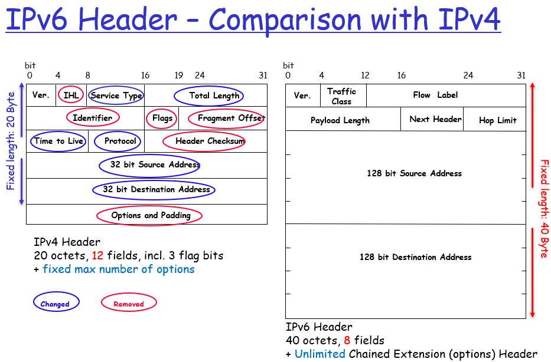
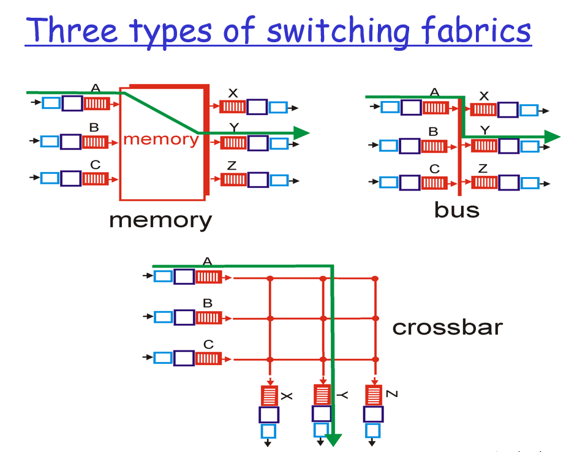

# 计算机网络复习

一张A4纸

单选题、简答题

简答题分要点写，要点下面分小要点写

强调：理解

## what is internet

### “nuts and bolts” view：具体构成描述

* 主机（hosts）或称端系统（end system）：运行着网络应用的计算设备
* 通信链路：电缆、铜线、光纤、电磁波、卫星等将端系统连接在一起
* 大量的包交换：路由器+连接层交换机在转发数据包
* 控制着数据发送的协议：TCP, IP, HTTP, Skype,  Ethernet
* 网络的网络 - Internet：loosely hierarchical松散的等级制度、public Internet versus private intranet
* Internet标准：RFC - Request for comments、IETF - Internet Engineering Task Force
* 通信基础设施：

### a service view：为应用程序提供服务的基础设施角度描述

* 分布式应用程序：Web, VoIP, email, games, e-commerce, file sharing
* 为分布式应用程序提供的通信服务：可靠通信、尽最大可能通信

### internet 和 Internet 的区别

以小写字母 i 开始的 internet（互联网或互连网）是一个通用名词，它泛指由多个计算机网络互连而成的网络。 

以大写字母I开始的的 Internet（因特网）则是一个专用名词，它指当前全球最大的、开放的、由众多网络相互连接而成的特定计算机网络，它采用 TCP/IP 协议族作为通信的规则，且其前身是美国的 ARPANET。

## Edge和Core

* 网络边缘：应用和主机/端系统
  * Client/Server模型：客户端从服务器处接受服务。例Web browser/server、email client/server
  * peer-peer模型：很少使用或完全不使用专用服务器。例Skype,  BitTorrent
* 接入网、物理线路：有线/无线通信链路
* 网络核心：相互连接的路由器、网络的网络
  * packet-switching：分组交换方式，数据被切分成一个个数据片进行传输
  * circuit switching 电路交换方式，每一个数据传输都占用一个专用的线路

## 网络延迟

4种网络延迟：

* 节点处理时间：检查误码、决定出口
* 排队时间：在输出端口处的排队时间。依赖于网络拥塞程度
* 传输时间：将数据传化为信号、通信链路单位时间内能传输的信号有有限
* 传播时间：信号在电路中传到另外一端的时间

一些其他的延迟：

* 一些协议自带延迟发送功能
* media packetization delay介质包装延迟：流数据必须先填满一个最小的包才能打包发送，多见于视频电话应用中

## 丢包Packet loss

交换机队列长度有限，队列满后来的包被丢弃

丢包后重传也会反映在最终的延迟上

## 吞吐量：发送端和接收端之间每秒可以传送的bit数量

## 加密技术名词

* Malware：恶意软件
  * 病毒：破坏计算机功能或者数据的代码，需要一定的用户交互（如接收Email运行病毒程序等）
  * 蠕虫：通过网络进行自我传播的恶意程序，不需要通过用户交互即可进入计算机
  * 木马：用作控制远程计算机的后门程序，隐藏在其他程序中
* Spyware：间谍软件
  * 监控并收集键盘输入、网站浏览记录等
* Botnet：僵尸网络
  * 控制计算机执行某种任务的网络
  * 执行广告、发动DDoS攻击等
* DoS：拒绝服务攻击
  * Vulnerability attack：漏洞攻击
  * DDoS：分布式拒绝服务攻击，短时间内发送大量请求致使对方网络瘫痪
  * Bandwidth flooding：带宽泛洪
  * Connection flooding：连接泛洪
* IP spoofing：IP地址欺骗。产生的IP数据包为伪造的源IP地址，以便冒充其他系统或发件人的身份
* packet sniffing：数据包嗅探。获取网络上流经的数据包
  * 可从无线信道、广播信道、受控的路由器处获取数据包
* record-and-playback：记录某个操作的包并在之后回放（如付款等）

## Internet历史中的名词概念

### 1961-1972: Early packet-switching principles:

* Baran - packet-switching in military nets
* ARPAnet(Advanced Research Project Agency network)
* NCP (Network Control Protocol) first host-host protocol

### 1972-1980: Internetworking, new and proprietary nets:

* ALOHAnet satellite network in Hawaii
* Cerf和Kahn建立了TCP/IP
* Ethernet at Xerox PARC
* proprietary architectures: DECnet, SNA, XNA

### Cerf and Kahn’s internetworking principles:

* minimalism, autonomy - no internal changes required to interconnect networks
* best effort service model
* stateless routers
* decentralized control

### 1980-1990: new protocols, a proliferation of networks

TCP/IP、DNS、ftp、TCP congestion control、Csnet, BITnet, NSFnet, Minitel

1989-1991: Web was invented at CERN

### 1990, 2000’s: commercialization, the Web, new apps

* WWW：hypertext、HTML、HTTP、Mosaic浏览器、Netscape浏览器
* 即时通讯、P2P、网络安全日渐重要

## 分组交换Packet switched 

分组交换的方式分为 datagram networks和virtual circuit networks两种
* datagram networks：网络层无连接服务，比如UDP
* 虚电路Virtual circuit (VC) ：网络层有链接服务，比如TCP

### 虚电路

从起点到终点的一条路径，类比电话线路

* 在传输数据前先建立连接
* 每个分组都携带VC identifier而不是目的地址
* 路径上的每个路由器都维护连接的状态
* 连接/路由资源与VC相关联

#### 组成部分

* 从源到目的的一条链路
* 每条链路都有不同的VC标记
* 沿途所有路由器转发表中的条目（建立连接则新增条目，断开连接则删除条目）

#### 运行过程：signaling protocols

1. Initiate call：发送端初始化调用
2. incoming call：接收端收到调用
3. Accept call：接收端接收调用
4. Call connected：发送端连接建立完成
5. 发送端发送数据
6. 接收端接收数据

### Datagram Network 数据报网络

* 网络层没有建立连接的过程
* 路由器中不维护连接状态信息
* 每个分组都携带目的地址，分组转发使用目的地址
  * 不同分组可能走不同的路径

### 虚电路 vs 数据报网络

数据报网络|虚电路
-|-
用于计算机间的数据传输|用于电话网络
没有严格的时间要求|严格的时间要求、可靠的数据传输
端系统处程序复杂|端系统处程序简单
网络内部程序简单|网络内部程序复杂

数据报网络中的端系统角色复杂，难统一服务

## Internet Protocol (IP)

* 应用层：应用服务，HTTP、FTP、SMTP、...
* 传输层：提供可靠的传输服务，TCP、UDP
* 网络层：无连接的分组传输
  * ARP (Address Resolution Protocol)
  * RARP (Reverse Address Resolution Protocol)
  * ICMP (Internet Control Message Protocol)
  * IGMP (Internet Group Management Protocol)
* 链路层：向上层隐藏下层物理结构，
  * IP地址是网络层面的地址，用于向目的子网发送数据报
    * 可类比为邮编，每个地域的邮编都有固定的形式，每个地域都不一样，不随人变化
  * MAC(Media Access Control)地址，又称LAN地址或物理地址或Ethernet地址，是链路层面的地址，用于发送MAC帧到具体的端口
    * 可类比为身份证号，每个人一个，人走到任何地域身份证号都不会变

## ARP

通过ARP将IP地址与MAC动态绑定，以避免使用集中式的数据库。

### 运行原理

* LAN内的那个IP节点（端系统或路由器）都有一张ARP表
* ARP表记录了LAN中每个IP地址对应的MAC地址
* 向某个IP发送数据时，查询IP对应的MAC地址，向对应端口发送即可

### 动态绑定

当某个IP不在ARP表中时：

1. 广播ARP查询指令，查询目的IP的MAC地址
2. 目的IP对应的主机收到查询发回自己的IP和MAC地址
3. 存入ARP表

## IP数据报格式

## IPV4地址

* 一个IP地址代表端系统或路由器上的一个接口
  * 每个地址表示一个到网络的连接而不是独立的计算机
  * 当计算机位置变了，它的IP地址必须变
* 接口：路由器/端系统互相之间的物理链路
  * 一个路由器通常有多个端口
  * 一个端系统通常只有一个端口

### Classful IP Addresses：分类IP编址

IP地址的前面部分作为网络地址，网络中的所有主机的IP地址只有后面部分不一样。网络地址按前缀长度分为ABC三类，每一类的前缀长度是固定不变的。

#### 分类IP编址下的路由表

路由表中存着许多网络地址，每个网络地址对应一个下一跳IP地址或某个接口。当有数据报到达时，检查数据报IP所属哪个物理网络地址：

* 间接交付：某个网络地址对应一个下一跳地址，数据报由下一跳网络中的某个路由器继续转发
* 直接交付：某个网络地址对应一个接口地址，数据报直接从某个接口出去到对应的网络
* 默认路由：某个地址在路由表中没有下一跳也没有接口对应，则发送到默认地址
  * 默认地址通常用于一个小的网络到一个大的广域网的转发

#### 优缺点

* 优点：路由表中只需要放网络地址而不是每个主机的地址
* 缺点：每个物理网络都要分配地址前缀，每个前缀包含许多地址，让IP地址消耗很快
  * 地址前缀的长度固定，但有的物理网络主机很多，需要很多的IP，而有的物理网络主机很少，IP浪费

### 子网掩码：地址前缀的长度不固定

网络地址不再按固定的前缀长度分为ABC三类，而是通过一个子网掩码指定所属的网络。

主机很多的网络给个短点的子网掩码，主机很少的网络给个长点的子网掩码，从而提高IP地址利用率。

CIDR表达方式：IP地址/掩码长度

#### 分类IP编址+子网掩码下的路由表

路由表中存储的不再是固定的ABC类网络地址，而是IP地址/掩码长度。当有数据报到达时，检查数据报IP所属的网络是通过将IP地址与掩码进行与运算得到，其他操作与没有子网掩码时完全一样。

#### 分类IP编址+子网掩码下的地址分配策略：Classless Inter-Domain Routing (CIDR) 无分类域间路由选择

ISP分配的IP地址不再区分ABC类而是按照主机数量分配网络地址和合适大小的子网掩码。

#### 路由聚合（地址聚合）

将多个同网段的小子网聚合成一个大子网。一个拥有多个同网段小子网的ISP的网际路由器可以只向Internet报告大子网的地址（短的子网掩码），到不同的小子网的数据报由ISP内部的路由器进行进一步处理。

当某个小子网转到了另一个不同网段的ISP中，则最长前缀匹配可以保证较小子网的地址被有限匹配到。

### Anonymous P2P：匿名点对点网络

### NAT：让内网主机访问外网

将内网发往公网的数据报源IP地址从私网地址改为公网地址，用不同的端口区分发回的数据报。

优点：

* 建立了公网和私网间的简易网关
* Stateful Filter Implementation使得使用NAT可以提升网络安全性
* 隐藏的网络内部的架构

#### 外部主机无法主动访问NAT内部主机的解决方法

* 配置静态端口映射
* 基于UPnP的IGD协议：自动配置端口映射
  1. 获知公网（外部）IP地址
  2. 请求一个新的公网IP地址
  3. 列举现有的端口映射
  4. 添加和移除端口映射
  5. 给映射分配租赁时间
* relay：内网穿透

### 为延缓IPV4地址消耗而做出的努力

* Dial-access / PPP / DHCP
* Strict allocation policies
* CIDR
* NAT

## ICMP: Internet Control Message Protocol 网际控制报文协议

* 端系统和路由器之间的网络层信息通信
  * 错误报告
    * 目的不可达
    * Source quench-源端抑制 其表示路由或者主机因为网络拥塞丢弃了报文
    * 超时
    * 参数错误
    * 重定向
  * 查询（比如用在ping程序中）
    * 响应(request/reply)
    * 时间戳(request/reply)
    * 地址掩码(request/reply)
    * Router Advertisement(简称RA),Router Solicitation(简称RS)

ICMPv6：
* ICMPv6邻居请求（Neighbor Solicitation）消息：在地址解析中的作用类似于IPv4中的ARP请求报文。用来获取邻居的链路层地址，验证邻居是否可达，进行重复地址检测等
* 邻居通告报文NA（Neighbor Adivertisment）报文：用来对NS消息进行响应或当节点在链路层变化的时候主动发出NA消息，告知邻居本节点的变化
* ICMPv6路由器请求（Router Solicitation）消息：节点启动后，通过RS消息向路由器发出请求，请求前缀和其他配置信息，用于节点的自动配置
* ICMPv6路由器通告（Router Advertisement）消息：在没有抑制RA消息发布的条件下，路由器会周期性地发布RA消息，其中包括前缀信息选项和一些标志位的信息
* ICMPv6重定向（Redirect）消息：Type字段值为137，当满足一定的条件时，缺省网关通过向源主机发送重定向消息，使主机重新选择正确的下一跳地址进行后续报文的发送

## IGMP：Internet Group Management Protocol Internet组管理协议

主机IP软件需要进行组播扩展，才能使主机能够在本地网络上收发组播分组。但仅靠这一点是不够的，因为跨越多个网络的组播转发必须依赖于路由器。路由器为建立组播转发路由必需了解每个组员在Internet中的分布，这要求主机必须能将其所在的组播组通知给本地路由器，这也是建立组播转发路由的基础。主机与本地路由器之间使用Internet组管理协议（IGMP，Internet Group Management Protocol）来进行组播组成员信息的交互。

## IPV6

* 简单的报文头结构
* 降低了通常情况下的分组处理开销
* 保持了低的带宽开销
* 灵活可扩展的自定义分组头信息
* 为64位处理器架构优化

### IPV6和IPV4兼容

* 双协议栈：在一个设备上同时部署IPV6和IPV4两种协议
* 隧道技术：将IPV6作为内容封装在IPV4中发送
* 协议翻译Translation：NAT技术的扩展
  * 与IPV6设备通信使用正常的IPV6协议
  * 与IPV4设备通信使用NAT

## Unit 3

### What inside router

* 路由表 Forward Tables
  * 由路由器自己确定
  * 由一个统一的中心下发（SDN）

### SDN的基本概念

一个总的集中的控制器计算出转发表下发给系统中的路由器。

* 基于流的转发：SDN路由器/交换机可以定义从运输层到网络层到链路层的所有转发规则，而不再拘泥于基于IP地址的转发
* 控制与转发分离
* 可编程性

## 三种类型 Three types of switching fabrics

### 输入排队

* 产生情况：交换结构不能相对于输入线路速度快到使所有的分组无延迟地通过它传送
* 产生排队延迟
* Buffer满时产生丢包

### 交换机Output port的排队

* 产生情况：在输出端口传输一个分组的时间内，又有多个分组到达该端口
* 产生排队延迟
* Buffer满时产生丢包

## Hubs (more)集线器

* 集线器可以按层次结构（或多层设计）排列，骨干集线器位于顶部
* 简单，便宜的设备
* 延长节点对之间的最大距离（每个集线器100m）
* 集线器通常用于小型网络，在该小型网络中，通过网络传输的数据量永远不会很高。

## Switch有哪些功能

* 链路层设备：比集线器更智能，发挥积极作用
  * 存储，转发以太网帧
  * 检查传入帧的MAC地址，在要在段上转发帧时有选择地将帧转发到一个或多个传出链接
* 透明
  * 主机不知道交换机的存在
* 即插即用，自学习
  * 交换机无需配置
  * 交换机内存有一个转发表
  * 交换机可以从转发的帧中获取到MAC地址，与接口位置一起存入转发表
  * 如果帧指向的某个MAC地址未找到，则向除源端口外的所有端口转发
  * 一个MAC地址对应一个端口，一个端口可以对应多个MAC地址，因此可以级联
* 允许多个同时传输
  * 每个端设备都有一个独立连接
  * 缓存分组进行转发
  * 没有线路冲突，全双工
  * 可同时执行多条路径间的转发

## Comparison of Typical Features of Popular Interconnection Devices

|集线器|交换机|网桥|路由器
-|-|-|-|-|
工作于|物理层|链路层|链路层|网络层
通信隔离|否|是|是|是
即插即用|是|是|是|否
可选的路由||否|否|否|是

什么叫Overlay、SDH、WDM

MPLS原理是什么

Potential Advantages Of Switching For IP Forwarding

SLA、QoS

Multilayer Switching Alternatives to the IP-over-ATM Model发展历史

MPLS原理、应用（VPN、traffic engineering）

Per-router control: Individual routing algorithm components interact in the control plane有什么区别

A data center network with a hierarchical topology了解一下

## Unit 4

socket to socket、IP地址加Port number

Transport services and protocols、reliable是TCP和unrelable是UDP

How demultiplexing works

什么应用用TCP，什么用UDP

TCP和UDP的segment

rdt3.0 in action丢包是怎么分析的

rdt是如何从简单到复杂一步步分析的

Go-Back-N (sliding window protocol)（有一个课后题）

SR receiver dilemma with too-large windows: A new packetor a retransmission?知道要调整窗口就行了

TCP segment structure每个field该怎么用

Sequence number counting the number of bytes

TCP Round Trip Time and Timeout知道有这么回事

TCP flow control

fast recovery/retransmit

Principles of Congestion Control，从简单到复杂情况分析Approaches towards congestion control

AIMB、slow start

Global centerlization、RED

TCP fairness

## Unit 5

三个应用，他们的特点是什么：
5.1 multimedia networking applications
5.2 streaming stored audio and video
5.3 making the best out of best effort service

MM Networking Applications 

Jitter是什么

三个service model有什么特点

How should the Internet evolve to better support multimedia?

Three approaches to supporting MM app.

QoS Summary四个柱子，哪些QOS支持

Priority scheduling

## Unit 6

RAT OSPF