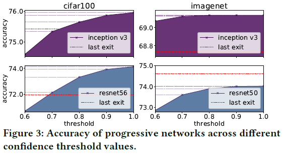
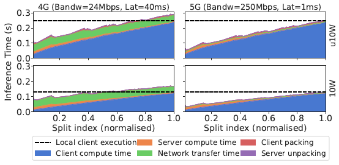

# SPINN: Synergistic Progressive Inference of Neural Networks over Device and Cloud

```bibtex
@article{SPINNSynergisticProgressiveInference2020,
  title = {{{SPINN}}: {{Synergistic Progressive Inference}} of {{Neural Networks}} over {{Device}} and {{Cloud}}},
  shorttitle = {{{SPINN}}},
  author = {Laskaridis, Stefanos and Venieris, Stylianos I. and Almeida, Mario and Leontiadis, Ilias and Lane, Nicholas D.},
  year = {2020},
  month = sep,
  pages = {1--15},
  doi = {10.1145/3372224.3419194},
  archivePrefix = {arXiv},
  eprint = {2008.06402},
  eprinttype = {arxiv},
  journal = {Proceedings of the 26th Annual International Conference on Mobile Computing and Networking},
  keywords = {Computer Science - Computer Vision and Pattern Recognition,Computer Science - Distributed; Parallel; and Cluster Computing,Computer Science - Machine Learning,Statistics - Machine Learning},
  language = {en}
}
```

## 摘要

* 本文面向的核心问题：在移动设备上维持高性能计算
* 此问题目前常见的解决方法：将计算任务通过网络发给云计算
* 此解决方法存在的问题：
  * 移动设备的网络连接具有动态性和不稳定性
  * 不适合对实时性要求较高的应用场景，比如无人机避障
* 本文如何解决这个问题：SPINN
  * 本地设备-云协同计算
  * progressive inference method
* SPINN核心：
  * 一种在运行时动态确定退出策略并对网络进行拆分的调度器

## Introduction


* CNN(卷积神经网络)驱动的应用越来越广泛
* CNN计算量很大，大到在很多移动设备上无法运行
* 现在许多应用提供商采用cloud-centric solutions：将计算任务发送到云端计算再返回结果(Server Only)，从而解决算力不够的问题

### Server Only solutions的代价

* 性能极大依赖于网络条件，缺乏网络容错能力
* 在云端托管机器学习计算资源成本很高
* 数据走网络有隐私泄露风险

### Synergistic solutions

部分计算在本地设备完成，部分计算在云端完成

* 和Server Only一样，性能极大依赖于网络条件，缺乏网络容错能力
* 无法适应对多个维度均有严格要求的应用（延迟、吞吐量、正确率、设备和云计算成本）

### SPINN

* 先进的神经网络推理机制，使云端和本地设备上的CNN推理过程高效而可靠
  * 在已有的提前退出机制的基础之上，实现了一个early-exit-aware cancellation mechanism：当设备计算出足够准确的结果时中断计算过程，从而最小化冗余的计算和通信量
  * 同时，对于不稳定的网络，在实现提前退出方案时考虑了系统的执行能力，以适应云端不可用的情况
  * 通过在骨干网中谨慎地放置神经网络出口，保证了系统的响应能力和可靠性，并克服了现有卸载系统的局限性
* 一种CNN专用的中间数据打包方法，利用CNN的弹性(?resilience?什么意思)和稀疏性最大程度上减少传输开销
  * 结合了无损和考虑了模型正确率的有损压缩方法
* 考虑到了SLA(服务等级协议)和使用场景的调度器
  * 对以下几个方面进行联合优化
    * 提前退出策略
    * 那些部分在云端算哪些在本地算
  * 将用户指定的各种性能参数的重要性权重矩阵翻译为SLA
  * 根据实际情况动态地选择可以实现最高性能的策略：
    * 通过监视不稳定的网络状况和运行时的资源负载
    * 上下文运行时信息
    * 先前执行计算的历史数据

## 已有工作

## 系统概述


1. 离线过程：**渐进式推理模型生成器**对模型及各个出口进行训练
2. 离线过程：**模型分割器**定位所有可以分割到云端和边缘进行计算的分割点
3. 离线过程：**离线分析器**计算模型的退出概率和每个出口的分类正确率；用历史数据中的客户端和服务器性能作为性能估计初始值
4. 在线过程：**调度器**获取性能估计初始值、目标SLAs、运行时环境情况，决定模型划分方案和提前退出策略
5. 在线过程：**通信优化器**利用CNN的稀疏性和弹性压缩数据
6. 在线过程：**执行器**执行通信和计算过程
   * 同时，一个**在线分析器**时刻监测着执行过程，将收集到的数据作为下一次离线过程的基础数据

## 渐进式推理模型生成器

渐进式推理模型生成器负责从一个CNN模型生成一个渐进式的推理模型。这一过程涉及到三个重要的设计决策：
* 提前退出（提前退出点的数量、位置和结构）
* 训练模式
* 提前退出策略

### 提前退出

* 数量：在SPINN中，提前退出点放置在能将模型按照FLOPS均匀划分计算量的位置。
* 位置：在后面的实验中，提前退出点将放置在15%、13%、...、90%FLOP的位置。
* 结构：将提前退出点的结构视为固定的，并且适配[MSDNet(多尺度密集网络)](../人工智能/MSDNet.md)，使得每个退出点都有相同的表现力 **（提前退出点的“结构”(architecture)是指什么？为什么适配MSDNet？“有相同的表现力”(expressivity)是指什么？）**

### 训练模式

提前退出网络的overthinking现象：在浅层网络中分类准确率很高的样本到了深层网络中分类准确率反而变低了。参见论文[Shallow-Deep Networks: Understanding and Mitigating Network Overthinking](https://arxiv.org/abs/1810.07052)。SPINN使用了这篇论文中介绍的代价函数和训练方法，以克服overthinking现象。

本文所使用的训练模式要求在训练之前固定提前退出点的位置。这种方法虽然不灵活，但是固定提前退出点的位置可以使得退出点处的网络和原始网络一起训练，比把原始网络和退出点处的网络分开单独训练效果更好。（注：BranchyNet里面也是这样做的）

### 提前退出策略

给定一个$thr_{conf}$值，当某个退出点的softmax层输出的置信度的最大值大于$thr_{conf}$时就在这里退出。如果前面几层都没有输出大于$thr_{conf}$的置信度，那就自然从最后一层退出了。

### $thr_{conf}$对系统的影响


$thr_{conf}$越大，样本在浅层网络退出的概率越小，越多的的样本在深层的退出点才能退出。进而：

* 计算量越大：显而易见，算的层数越深计算量越大
* 正确率越高：在深层的退出点输出的计算结果显然会有较高的正确率，如下图所示。

  * 红色线表示没有中间退出点的原始网络网络分类正确率。由于overthinking现象的存在，可以看到有些原始网络的分类正确率还不如提前退出网络

因此，$thr_{conf}$就是调节计算量和正确率的trade off的关键参数。

## 模型分割器

模型分割器负责将渐进式推理模型生成器生成的模型切分为在客户端和在服务器上运行的两个部分。
* 定义可能的切分位置
* 自动地在给定的CNN上查找切分位置

### 切分位置的决策空间

对于一个$N_L$层的网络，如果不限制切成几块，其可能的切分就是$2^{N_L-1}$。但是：
* 服务器算力很强，卸载到服务端上计算的网络进行切分只会增加通信开销
* ReLU层将负值全变成0，其输出有稀疏性

因此，为了方便压缩节约通信成本，SPINN只在ReLU层中选择切分点，并且切分点只用于卸载到服务器之前的网络中。。

### 自动寻找切分位置

* 将神经网络组织为一个执行图
* 寻找所有切分点
* 用上述方法生成切分位置的决策空间
* 由调度器从决策空间中动态地选择切分位置

### 切分位置对系统的影响



* 客户端计算时间-服务端计算时间-通信时间 trade off
  * 在越深的层切分：
    * 客户端计算时间越多
    * 服务端计算时间越少
    * 卸载到服务端的概率越低
  * 带宽越小，通信代价越大
  * 客户端性能越差，在客户端计算耗时越多

## 分析器

### 离线过程

离线过程仅在部署前进行一次

* 对神经网络进行分析：
  * 对所有切分方案下都计算数据传输量
  * 在不同$thr_{conf}$下计算平均正确率
* 对设备进行分析：
  * 估计到每个切分点$s$的计算时间$T^{offline}\langle s\rangle$

### 在线过程

将离线过程的结果作为初始数据。
* 估计客户端上的延迟：
  1. 测量计算到某个切分点$s$的计算时间$T^{real}\langle s\rangle$
  2. 计算延迟缩放参数$SF=\frac{T^{real}\langle s\rangle}{T^{offline}\langle s\rangle}$
  3. 更新其他点$s'$的离线估计值为$SF\cdot T^{offline}\langle s'\rangle$
* 估计服务器上的延迟：
  * 如果服务器端能直接返回计算时间$T^{server}\langle s\rangle$，那就可以直接计算$SF$
  * 如果服务器端不支持返回计算时间
    * 那就通过总时间和网络带宽估计计算时间$T^{server}\langle s\rangle=T^{response}\langle s,e\rangle-\left(L+\frac{D_{response}}{B}\right)$
      * $T^{response}\langle s,e\rangle$：返回结果的总耗时
      * $D_{response}$：返回的总数据量
      * $B$和$L$：网络的瞬时带宽和瞬时延迟估计值，在传输过程中通过滑动平均计算得到

## 动态调度器

* 优化变量$\sigma=\langle s,thr_{conf}\rangle$：切分点位置和每个出口的置信度
* 优化目标$\mathcal M=\langle latency, throughput, server cost, device cost, accuracy\rangle$：延迟、吞吐量、服务器负载、设备负载、正确率，每个优化目标方程都转化成取值越小越好的形式
* 优化方法：
  1. 用户指定$\mathcal M$中的所有优化目标的硬性限制，系统从$\sigma$可行值中剔除不可行的解
  2. 用户对$\mathcal M$中的所有优化目标进行排序，系统在$\sigma$的可行解上进行字典序多目标规划

字典序多目标规划：

$$
\begin{aligned}
  &\mathop{min}\limits_\sigma M_i(\sigma)\\
  s.t.\quad&M_j(\sigma)\leq M_j(\sigma_j^*)\\
  &i,j\in N_+,j<i\leq |\mathcal M|
\end{aligned}
$$

即，对于第$i$个优化目标$M_i$，在优化过程中除了需要调整$\sigma$使得$M_i(\sigma)$尽可能小之外，还需要保证前面所有优化项的值$M_j(\sigma)$不能比之前的优化结果$M_j(\sigma_j^*)$更差。

## 通信优化器

通信优化器中所使用的算法都是前人已经实现的算法。

1. 压缩模型：
  * 权值缩减
  * 量化神经网络(QNN)
2. 压缩数据：先估计一下压缩时间和压缩后所能节约的传输时间，如果总时间确实能减少那就执行压缩

## 分布式执行引擎

* 每到达一个退出位置，都将置信度和设定的阈值相比较，如果大于阈值则退出
* 数据的传输和计算分为两个线程并行地执行
* 云端推断和本地推断同时进行，如果本地推断先出了结果，就向云端发信息让其退出推断过程，以节约资源（云端可能有网络波动或暂时断线，导致本地出结果先于云端返回结果）