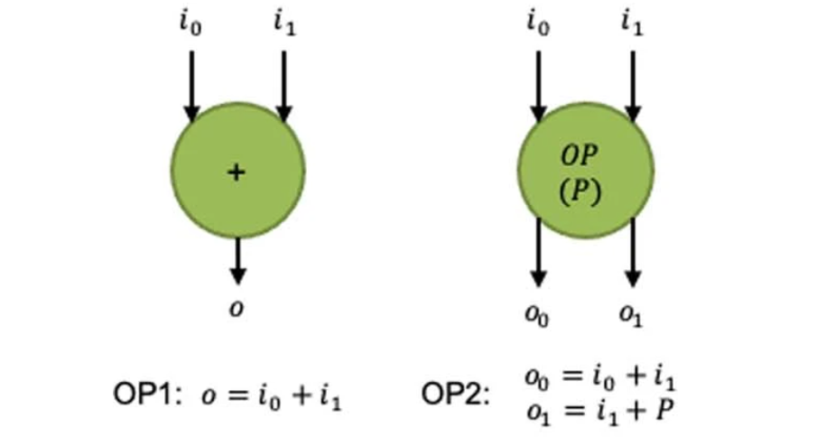
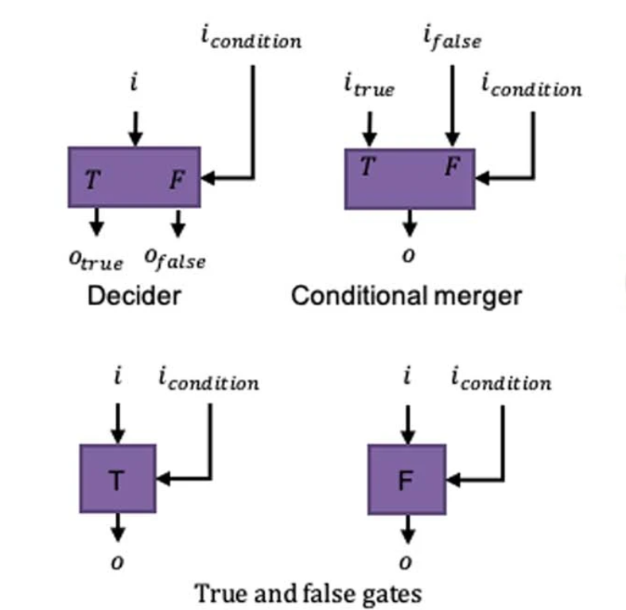

# A system hierarchy for brain-inspired computing

## 通用逼近器(Universal Approximator)和通用逼近理论(Universal Approximation Theorem)

通用逼近理论：对于足够大的、由两层的神经网络和一个ReLU非线性层组成的网络（即$y=ReLU(\bm w^Tx+b,0)$），可以通过合理设定参数矩阵来近似所有的连续函数或者各种其他函数 [Hornik et al., 1989, Cybenko, 1992,Barron, 1993]。

对比高等数学在讲无穷级数之前引入的Stone-Weierstrass第一定理：
* 闭区间上的连续函数可用多项式级数一致逼近

和讲傅里叶级数之前引入的Stone-Weierstrass第二定理：
* 闭区间上周期为$2\pi$的连续函数可用三角函数级数一致逼近

它们分别证明了多项式函数和三角函数在函数空间内的稠密性；而通用逼近理论则证明了类似ReLU的阶梯函数在函数空间内的稠密性。基于这种稠密性构建的通用逼近器计算式$y=ReLU(\bm w^Tx+b)$就是现在所有神经网络的基础。

## Neuromorphic Computing Capability 类脑计算能力

通用逼近器$y=ReLU(\bm w^Tx+b)$的核心目标是“逼近”，它的计算能力由它的逼近精度决定。

若存在两个可以生成函数的系统$A$和$B$，将$A$能生成的所有函数的集合记为$S_A$、将$B$能生成的所有函数的集合记为$S_B$，即：
$$
\begin{aligned}
S_A&=\{f(x)|f(x)\text{是由}A\text{产生的函数}\}\\
S_B&=\{f(x)|f(x)\text{是由}B\text{产生的函数}\}
\end{aligned}
$$

若以$D(f)$表示函数的定义域，则类脑计算的计算能力可以表述为：

$$
A\text{系统的类脑计算能力等于或强于}B\text{系统}:=(\forall\varepsilon\ge0)(\forall f_A\in S_A)(\exist f_B\in S_B)(\forall x\in D(f_A))||f_A(x)-f_B(x)||\le\varepsilon
$$

## Neuromorphic Complete 类脑计算完备性

$$A\text{系统是类脑计算完备的}:=A\text{系统的类脑计算能力等于或强于图灵完备系统}$$

### 图灵完备系统和通用逼近器的类脑计算完备性

* 证明图灵完备系统是类脑计算完备的：
  * 图灵完备系统的系统的类脑计算能力等于它自身
  * 因此图灵完备系统是类脑计算完备的
* 证明通用逼近器是类脑计算完备的：
  * 图灵完备系统所能生成的函数是图灵可计算函数
  * 通用逼近器生成的函数能以任意精度逼近任意函数
  * 通用逼近器生成的函数能以任意精度逼近图灵可计算函数
  * 通用逼近器的类脑计算能力大于或等于图灵完备系统
  * 因此通用逼近器是类脑计算完备的

### 图灵完备系统和通用逼近器的可组合性

>In computer science, function composition is an act or mechanism to combine simple functions to build more complicated ones. Like the usual composition of functions in mathematics, the result of each function is passed as the argument of the next, and the result of the last one is the result of the whole. ——Wikipedia

可组合性是指将两个简单的函数$f(x)$、$g(x)$组合成$f(g(x))$就能表示更加复杂的函数的过程。

对于图灵可计算函数的组合相当于将一个图灵机停机后的字符串作为另一个图灵机开始的字符串，这样的组合可以产生更加复杂的函数（相当于增加了图灵机的规则，使图灵机的计算能力更强）。

而对于通用逼近器，想要逼近更加复杂的函数或提高逼近的精度，则需要增加层中的神经元数量（即在$y=ReLU(\bm w^Tx+b)$中扩展$w$的长度）；而$f(g(x))$是增加了神经网络的层数。因此，通用逼近器组合无法产生更加复杂的函数，不具备可组合性。

## Programming Operator Graph (POG)

### FSOG(Finite State Operator Graph, 有限状态操作图)形式定义

FSOG为一个五元组$\psi$：

$$\psi=(G, T, \delta, q_0, F)$$

* $G$：操作图，$G=(V,E)$
  * 边$e_{v_1,v_2}\in E$表示Operator $v_1$的一个或多个数据事件需要传递给$v_2$，也可以看作是$v_1$和$v_2$间的数据依赖关系
  * 点$v\in V$表示一个Operator，当$v$和其他所有点的依赖关系被满足时，就可以开始计算
* $T$：事件集合
  * 数据事件$t_{d:i=v}\in T$：用于传输计算所需的输入数据，$v$表示一个字符串
  * 触发事件$t_s\in T$：不包含数据，仅用于表征Operator间的依赖关系
* $\delta$：状态转移函数，$\delta:2^{T\times E}\rightarrow2^{T\times E}$
* $q_0$：初始状态，$q_0\in2^{T\times E}$
* $F$：终结状态集（接受状态集），$F\subseteq 2^{T\times E}$

#### FSOG的瞬时描述（状态详解）

按照自动机理论的一般视角，FSOG的有限状态集$Q=2^{T\times E}$，其中的每一个状态（也即瞬时描述）：

$$q=\{(t,e)|t\in T\wedge e\in E\}\in Q$$

表示一系列事件与操作图中边的对应关系，状态中的对应关系$(t,e_{v_1,v_2})\in q$表示事件$t$在边$e_{v_1,v_2}$上被触发了，也同时表明$v_1$和$v_2$之间执行的依赖关系已经满足。

#### 定义FSOG的动作（状态转移函数详解）

FSOG状态转移函数可以看作是操作图中所有Operator的状态转移函数的集合：

$$\delta=\{f_v|f_v:2^{T\times \{e_{v_i,v}\in E|v_i\in V\}}\rightarrow 2^{T\times \{e_{v,v_o}\in E|v_o\in V\}},v\in V\}$$

其中每个Operator $v$的状态转移函数$f_v$就是一个输入边上的状态（事件-边元组的集合）$I_v\subseteq T\times \{e_{v_i,v}\in E|v_i\in V\}$到输出边上的状态$O_v\subseteq T\times \{e_{v,v_o}\in E|v_o\in V\}$的映射$O_v=f_v(I_v)$。由于$f_v$是离散的状态转移函数，因此它也可以看成是一系列状态转移规则的集合$\Delta_v$：

$$\Delta_v=\left\{I_v\rightarrow O_v|O_v=f_v(I_v)\right\}$$

在状态转移过程中，只有所有输入条件全部满足（即每个相连的输入边上都有事件触发）的Operator才能进行状态转移，这些Operator称为“使能”的Operator。在某个状态$q$中所有使能Operator的集合可以表示为：

$$V_{enabled}(q)=\{v|(\forall v_i\in V\wedge e_{v_i,v}\in E)(\exist t\in T)(t,e_{v_i,v})\in q\}$$

进而可以将状态转移函数$\delta$表达为：

$$
\delta(q)=\bigcup_{v\in V_{enabled}(q)}f_v\left(\{(t,e_{v_i,v})|v_i\in V\wedge(t,e_{v_i,v})\in q\}\right)
$$

## POG 扩展操作

除上文所述的 POG 的状态转移操作外，POG 还提供了一些扩展操作，这些操作可以由基本操作组合而来，因此包含这些扩展操作的POG与原始POG是等价的。

使用 POG 扩展操作可以帮助开发人员更快速有效地构造 POG。

### 带参数更新器(Parameter Updater)的POG

带参数更新器的FSOG为一个五元组$\psi$：

$$\psi=(G, T, \delta, q_0, F)$$

* $G$：操作图，$G=(V,E,P)$
  * 点$v\in V$和边$e_{v_1,v_2}\in E$含义同上
  * $P$是Operator的参数列表，$v$的参数$P[v]$表示一个只有Operator $v$才能访问和修改的符号串
    * 设$P$所有可能的取值情况集合为$\mathcal P$，$P\in\mathcal P$
    * 设参数符号集为$\Sigma_P$，$P[v]\in\Sigma_P^*$
* $T$：事件集合
  * 数据事件$t_{d:i=v}$含义同上
  * 参数更新事件$t_{u:p=x}$表示将该边所连接的点的参数修改为$x$
* $\delta$：状态转移函数，$\delta:2^{T\times E}\times \mathcal P\rightarrow2^{T\times E}\times \mathcal P$
* $q_0$：初始状态，$q_0\in2^{T\times E}\times \mathcal P$
* $F$：终结状态集（接受状态集），$F\subseteq2^{T\times E}\times \mathcal P$

#### 带参数更新器的FSOG的瞬时描述（状态详解）

显然，加入参数更新器后，每个Operator都是有状态的了，每个Operator与一个状态对应，表示为一个二元组$(v,p)\in \mathcal P$，进而FSOG的状态可以表示为：
$$q=2^{T\times E}\times\mathcal P$$

#### 定义带参数更新器的FSOG的动作（状态转移函数详解）

加入参数更新器后，状态转移函数不仅需要更新边上触发的事件，还需要更新Operator中的状态符号串，因此Operator状态转移函数的集合定义为：

$$\delta=\{f_v|f_v:2^{T\times \{e_{v_i,v}\in E|v_i\in V\}}\times \Sigma_P^*\rightarrow 2^{T\times \{e_{v,v_o}\in E|v_o\in V\}}\times \Sigma_P^*,v\in V\}$$

同理，其中的$f_v$可以看成是转移规则的集合$\Delta_v$：

$$\Delta_v=\left\{(I_v,p)\rightarrow(O_v,p')|(O_v,p')=f_v(I_v,p)\right\}$$

使能Operator的集合$V_{enabled}(q)$的定义不变，状态转移函数$\delta$表达为：

$$
\begin{aligned}
\delta(q)&=(\bigcup_{v\in V_{enabled}(q)}q_{t,e}(v),P')\qquad\text{其中，}\\
(q_{t,e}(v),P'[v])&=f_v\left(\{(t,e_{v_i,v})|v_i\in V\wedge(t,e_{v_i,v})\in q\},P[v]\right)\\
\end{aligned}
$$

#### 证明包含参数更新器的POG与原始POG等价

可以使用仅包含状态转移操作的Operator $v$模拟具有参数更新器的Operator：

* $v$有一条指向自身的边$e_{v,v}$，将需要更新的参数作为数据事件$t_{d:i=x}$其上传递
* $v$有一条用于更新参数的状态转移规则：
$$\{(t_{u:p=x},e_{v',v}),(t_{d:i=p},e_{v,v})\}\rightarrow\{(t_{d:i=x},e_{v,v})\}\in\Delta_v$$

其中，$v'$是通过$e_{v',v}$向$v$发送参数更新事件的Operator。

显然，此Operator $v$等价于一个带有参数更新器的Operator。因此包含参数更新器的POG与原始POG等价。

### Control-Flow Operator 控制流操作器

### Synapse 突触操作器

## POG 图灵完备性

## abstract neuromorphic architecture (ANA)

* 硬件设施由两部分组成：
  * 一系列处理单元组成，每个处理单元包括：
    * 计算单元：一系列执行计算的处理器
    * 调度单元：控制计算单元执行计算的处理器
    * 私有内存：一个只有处理单元内的计算单元和调度单元才能访问的内存
  * 连接处理单元的互联网络

### 一种ANA的实现方式：忆阻器阵列

## execution primitive graph (EPG)

* 控制流是一个有向图：
  * 点表示由一个或多个执行原语组成的基本块
  * 边表示把一个基本块的执行结果放到下一个基本块中进行下一步操作
* 数据流是一个有向图：
  * 点表示由一个执行原语
  * 边表示数据依赖关系

### 执行原语

* 加权求和操作：即向量积
* 元素层面上的修正线性单元(ReLU, rectified linear unit)：即对向量中的每个元素进行ReLU

### 执行原语的类脑计算完全性证明

* 将图灵完全的POG转化为EPG
* 类脑计算完全性将通用估计和通用计算联系起来